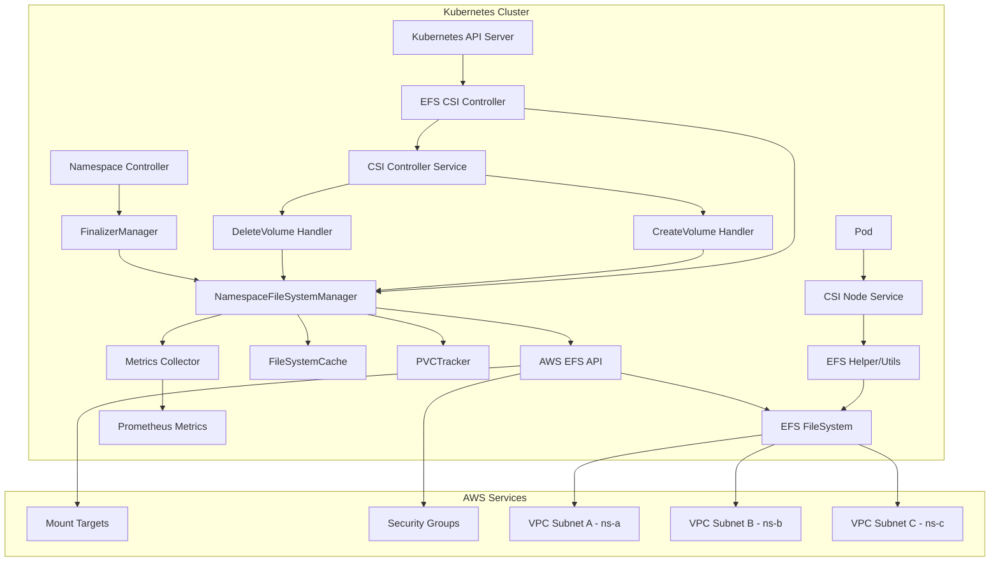
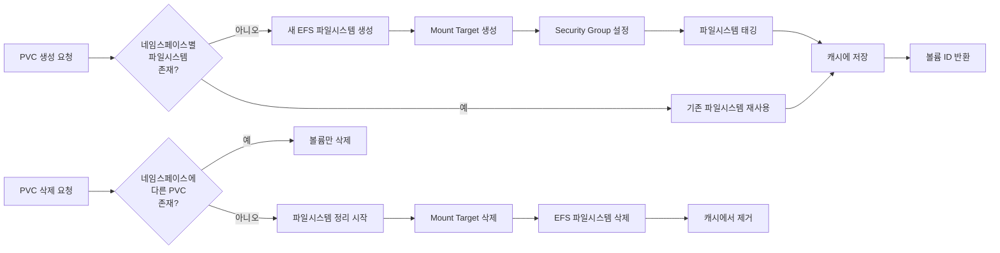
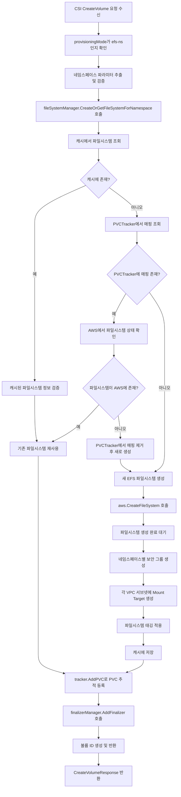
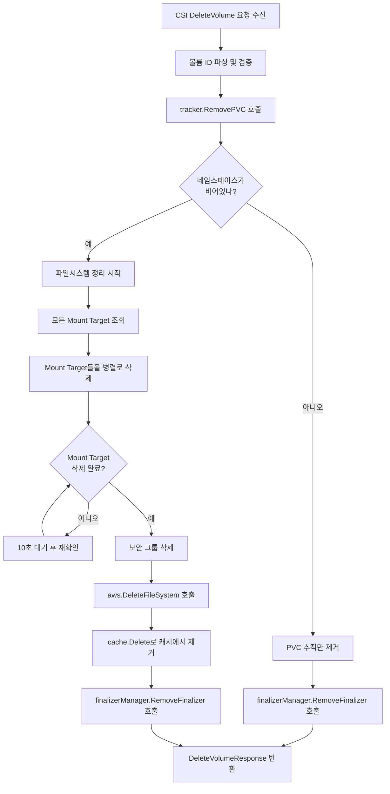
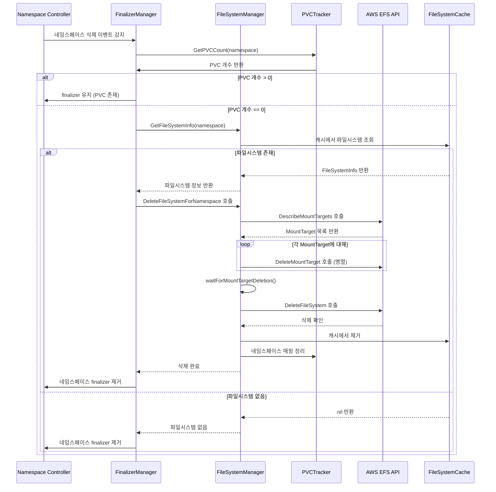
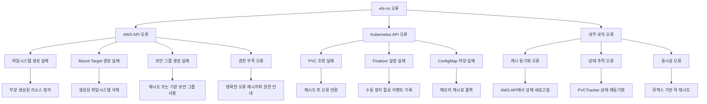

# efs-ns 구현 설계 문서

## 개요

efs-ns(네임스페이스별 EFS) 프로비저닝 모드는 AWS EFS CSI Driver에 추가되는 새로운 동적 프로비저닝 기능입니다. 각 Kubernetes 네임스페이스별로 독립적인 Amazon EFS 파일시스템을 자동으로 생성하고 관리하여, 네임스페이스 간의 완전한 스토리지 격리를 제공합니다. 기존의 efs-ap 모드가 Access Point를 생성하는 것과 달리, efs-ns 모드는 파일시스템 자체를 네임스페이스별로 관리합니다.

## 아키텍처 설계

### 시스템 아키텍처 다이어그램



### 데이터 흐름 다이어그램



## 컴포넌트 설계

### NamespaceFileSystemManager

**책임:**

- 네임스페이스별 EFS 파일시스템의 생성, 조회, 삭제 관리
- 파일시스템 생명주기 추적 및 캐시 관리
- AWS EFS API 통합

**인터페이스:**

```go
type NamespaceFileSystemManager interface {
    // CreateOrGetFileSystemForNamespace creates a new EFS filesystem for namespace or returns existing one
    CreateOrGetFileSystemForNamespace(ctx context.Context, namespace string, options *FileSystemOptions) (*FileSystemInfo, error)

    // DeleteFileSystemForNamespace deletes EFS filesystem if it's the last PVC in namespace
    DeleteFileSystemForNamespace(ctx context.Context, namespace string, volumeId string) error

    // GetFileSystemInfo retrieves filesystem info for a namespace
    GetFileSystemInfo(ctx context.Context, namespace string) (*FileSystemInfo, error)

    // ListFileSystemsForNamespace returns all filesystems for given namespace
    ListFileSystemsForNamespace(ctx context.Context, namespace string) ([]*FileSystemInfo, error)

    // SyncFromAWS synchronizes state with AWS EFS API
    SyncFromAWS(ctx context.Context) error
}

type FileSystemOptions struct {
    PerformanceMode              string            // generalPurpose or maxIO
    ThroughputMode              string            // bursting or provisioned
    ProvisionedThroughputInMibps *int64
    Encrypted                   *bool
    KmsKeyId                    *string
    Tags                        map[string]string
}

type FileSystemInfo struct {
    FileSystemId    string
    Namespace       string
    ClusterId       string
    CreatedAt       time.Time
    MountTargets    []*MountTargetInfo
    SecurityGroupId string
    State           FileSystemState
    PvcCount        int32 // Number of PVCs using this filesystem
    Tags            map[string]string
}

type MountTargetInfo struct {
    MountTargetId string
    SubnetId      string
    IPAddress     string
    State         string
}

type FileSystemState string

const (
    FileSystemStateCreating   FileSystemState = "creating"
    FileSystemStateAvailable  FileSystemState = "available"
    FileSystemStateDeleting   FileSystemState = "deleting"
    FileSystemStateDeleted    FileSystemState = "deleted"
)
```

**종속성:**

- AWS EFS API 클라이언트
- FileSystemCache (메모리 캐시)
- PVCTracker (Kubernetes 기반 영구 상태)

### FileSystemCache

**책임:**

- 네임스페이스별 파일시스템 정보를 메모리에 캐시
- 캐시 무효화 및 동기화 관리
- 성능 최적화를 위한 빠른 조회 제공

**인터페이스:**

```go
type FileSystemCache interface {
    // Get retrieves filesystem info from cache
    Get(namespace string) (*FileSystemInfo, bool)

    // Set stores filesystem info in cache
    Set(namespace string, fsInfo *FileSystemInfo)

    // Delete removes filesystem info from cache
    Delete(namespace string)

    // List returns all cached filesystem info
    List() map[string]*FileSystemInfo

    // Refresh refreshes cache from AWS API
    Refresh(ctx context.Context, namespace string) error

    // SetTTL sets cache TTL for entries
    SetTTL(duration time.Duration)
}
```

**특징:**

- Thread-safe 구현 (sync.RWMutex 사용)
- TTL 기반 자동 만료
- AWS API 호출 최소화

### PVCTracker

**책임:**

- PVC별 네임스페이스 매핑 추적 (Kubernetes ConfigMap 기반)
- 네임스페이스 내 PVC 개수 관리
- 파일시스템 삭제 시점 결정 지원
- 클러스터 재시작 시 상태 복구

**인터페이스:**

```go
type PVCTracker interface {
    // AddPVC tracks a new PVC in the namespace
    AddPVC(ctx context.Context, namespace, pvcName, volumeId string) error

    // RemovePVC removes PVC tracking and returns true if namespace is now empty
    RemovePVC(ctx context.Context, namespace, pvcName string) (isNamespaceEmpty bool, err error)

    // GetPVCCount returns number of PVCs in namespace
    GetPVCCount(ctx context.Context, namespace string) (int32, error)

    // ListPVCsInNamespace returns all PVC names in namespace
    ListPVCsInNamespace(ctx context.Context, namespace string) ([]string, error)

    // SyncWithCluster synchronizes tracking data with actual cluster state
    SyncWithCluster(ctx context.Context) error
}

type PVCMappingEntry struct {
    Namespace    string    `json:"namespace"`
    PVCName      string    `json:"pvcName"`
    VolumeId     string    `json:"volumeId"`
    FileSystemId string    `json:"fileSystemId"`
    CreatedAt    time.Time `json:"createdAt"`
}
```

**저장소:**

- ConfigMap을 사용한 Kubernetes 네이티브 저장
- 네임스페이스별 ConfigMap 분리 (확장성 고려)
- JSON 형태로 직렬화하여 저장

### FinalizerManager

**책임:**

- 네임스페이스 및 PVC에 대한 finalizer 관리
- 리소스 정리 완료 후 finalizer 제거
- Kubernetes 객체 생명주기 통합

**인터페이스:**

```go
type FinalizerManager interface {
    // AddFinalizer adds efs-ns finalizer to PVC
    AddFinalizer(ctx context.Context, pvc *corev1.PersistentVolumeClaim) error

    // RemoveFinalizer removes efs-ns finalizer from PVC
    RemoveFinalizer(ctx context.Context, pvc *corev1.PersistentVolumeClaim) error

    // AddNamespaceFinalizer adds finalizer to namespace for cleanup
    AddNamespaceFinalizer(ctx context.Context, namespace string) error

    // RemoveNamespaceFinalizer removes finalizer from namespace
    RemoveNamespaceFinalizer(ctx context.Context, namespace string) error

    // ProcessFinalization handles finalizer-based cleanup
    ProcessFinalization(ctx context.Context, object client.Object) error
}

const (
    EFSNSFinalizerName = "efs-csi.aws.com/efs-ns-cleanup"
)
```

## 데이터 모델

### 핵심 데이터 구조 정의

```go
// StorageClass Parameters for efs-ns mode
type EFSNSStorageClassParameters struct {
    ProvisioningMode            string            `json:"provisioningMode"`        // "efs-ns"
    PerformanceMode             string            `json:"performanceMode"`         // "generalPurpose" | "maxIO"
    ThroughputMode              string            `json:"throughputMode"`          // "bursting" | "provisioned"
    ProvisionedThroughputInMibps *int64           `json:"provisionedThroughputInMibps"`
    Encrypted                   *bool             `json:"encrypted"`
    KmsKeyId                    *string           `json:"kmsKeyId"`
    Tags                        map[string]string `json:"tags"`
    EncryptInTransit            *bool             `json:"encryptInTransit"`
}

// Volume ID format: fs-{filesystem-id}::efs-ns::{namespace}::{cluster-id}
type EFSNSVolumeId struct {
    FileSystemId string
    Namespace    string
    ClusterId    string
}

func (v *EFSNSVolumeId) String() string {
    return fmt.Sprintf("fs-%s::efs-ns::%s::%s", v.FileSystemId, v.Namespace, v.ClusterId)
}

func ParseEFSNSVolumeId(volumeId string) (*EFSNSVolumeId, error) {
    parts := strings.Split(volumeId, "::")
    if len(parts) != 4 || parts[1] != "efs-ns" {
        return nil, fmt.Errorf("invalid efs-ns volume ID format: %s", volumeId)
    }
    return &EFSNSVolumeId{
        FileSystemId: strings.TrimPrefix(parts[0], "fs-"),
        Namespace:    parts[2],
        ClusterId:    parts[3],
    }, nil
}

// Error types for efs-ns operations
type EFSNSError struct {
    Type      EFSNSErrorType
    Operation string
    Namespace string
    Message   string
    Cause     error
}

type EFSNSErrorType string

const (
    ErrFileSystemCreationFailed    EFSNSErrorType = "FileSystemCreationFailed"
    ErrFileSystemDeletionFailed    EFSNSErrorType = "FileSystemDeletionFailed"
    ErrNamespaceValidationFailed   EFSNSErrorType = "NamespaceValidationFailed"
    ErrSecurityGroupCreationFailed EFSNSErrorType = "SecurityGroupCreationFailed"
    ErrMountTargetCreationFailed   EFSNSErrorType = "MountTargetCreationFailed"
    ErrCacheOperationFailed        EFSNSErrorType = "CacheOperationFailed"
    ErrTrackerOperationFailed      EFSNSErrorType = "TrackerOperationFailed"
)
```

## 비즈니스 프로세스

### 프로세스 1: efs-ns 볼륨 생성



### 프로세스 2: efs-ns 볼륨 삭제



### 프로세스 3: 네임스페이스 정리



## 오류 처리 전략

### 오류 분류 및 처리



### 복구 메커니즘

1. **부분 생성 리소스 정리**

   - 파일시스템 생성 중 실패 시 생성된 리소스 자동 삭제
   - Mount Target 생성 실패 시 파일시스템 롤백
   - 타임아웃 기반 정리 작업 (최대 10분)

2. **재시도 전략**

   - AWS API 호출: 지수 백오프와 최대 5회 재시도
   - 네트워크 오류: 즉시 재시도 후 지연 재시도
   - 리소스 대기: 폴링 간격 증가 (5초 → 30초)

3. **상태 동기화**

   - 캐시와 AWS 실제 상태 간 불일치 감지
   - 정기적 상태 검증 및 자동 수정 (5분 간격)
   - 메트릭을 통한 불일치 모니터링

4. **Graceful Degradation**
   - ConfigMap 저장 실패 시 메모리 캐시로 폴백
   - AWS API 장애 시 캐시된 정보로 일시적 운영
   - 중요하지 않은 실패는 경고 로그로 처리

## 테스트 전략

### 단위 테스트

- **NamespaceFileSystemManager**: 파일시스템 생성/삭제 로직, AWS API 모킹
- **FileSystemCache**: 캐시 동작, TTL 처리, 동시성 테스트
- **PVCTracker**: ConfigMap 기반 추적, 동시성 처리
- **FinalizerManager**: Finalizer 추가/제거, Kubernetes API 모킹

### 통합 테스트

- **AWS EFS API 통합**: 실제 AWS 환경에서 파일시스템 생성/삭제
- **Kubernetes API 통합**: PVC/네임스페이스 lifecycle 테스트
- **CSI 인터페이스**: CreateVolume/DeleteVolume end-to-end 테스트

### E2E 테스트

- **다중 네임스페이스 시나리오**: 각 네임스페이스별 독립적 파일시스템
- **PVC 생성/삭제 시나리오**: 다양한 StorageClass 파라미터 테스트
- **네임스페이스 삭제 시나리오**: Finalizer를 통한 정리 프로세스
- **오류 복구 테스트**: 네트워크 실패, AWS API 오류 시나리오

### 성능 테스트

- **동시 PVC 생성**: 동일 네임스페이스에서 여러 PVC 동시 생성
- **대규모 네임스페이스**: 100개 이상 네임스페이스에서 파일시스템 관리
- **캐시 성능**: 빈번한 조회/업데이트 상황에서 성능 측정

### 테스트 매트릭스

| 테스트 케이스 | 범위          | 자동화      | 목표 커버리지 |
| ------------- | ------------- | ----------- | ------------- |
| 단위 테스트   | 개별 컴포넌트 | 완전 자동화 | 95%           |
| 통합 테스트   | API 통합      | 완전 자동화 | 90%           |
| E2E 테스트    | 전체 시나리오 | 완전 자동화 | 85%           |
| 성능 테스트   | 부하/스트레스 | 반자동화    | 주요 시나리오 |
| 보안 테스트   | 권한/격리     | 수동 + 자동 | 100%          |

## 모니터링 및 메트릭

### Prometheus 메트릭

```go
var (
    efsNsFileSystemsTotal = prometheus.NewGaugeVec(
        prometheus.GaugeOpts{
            Name: "efs_ns_filesystems_total",
            Help: "Total number of efs-ns filesystems",
        },
        []string{"namespace", "cluster", "state"},
    )

    efsNsOperationDuration = prometheus.NewHistogramVec(
        prometheus.HistogramOpts{
            Name: "efs_ns_operation_duration_seconds",
            Help: "Duration of efs-ns operations",
            Buckets: prometheus.ExponentialBuckets(0.1, 2, 10),
        },
        []string{"operation", "namespace", "result"},
    )

    efsNsCacheHitRatio = prometheus.NewGaugeVec(
        prometheus.GaugeOpts{
            Name: "efs_ns_cache_hit_ratio",
            Help: "Cache hit ratio for efs-ns operations",
        },
        []string{"operation"},
    )
)
```

### 구조화된 로깅

```go
type EFSNSLogger struct {
    logger logr.Logger
}

func (l *EFSNSLogger) FileSystemCreated(namespace, fsId string, duration time.Duration) {
    l.logger.Info("EFS filesystem created",
        "namespace", namespace,
        "filesystemId", fsId,
        "duration", duration.String(),
        "operation", "create_filesystem",
    )
}

func (l *EFSNSLogger) FileSystemDeleted(namespace, fsId string) {
    l.logger.Info("EFS filesystem deleted",
        "namespace", namespace,
        "filesystemId", fsId,
        "operation", "delete_filesystem",
    )
}

func (l *EFSNSLogger) ErrorOccurred(operation, namespace string, err error) {
    l.logger.Error(err, "efs-ns operation failed",
        "operation", operation,
        "namespace", namespace,
    )
}
```

이 설계 문서는 efs-ns 프로비저닝 모드의 효과적이고 확장 가능한 구현 방안을 제시합니다.
