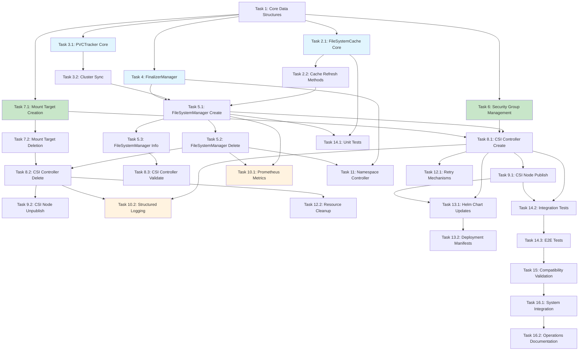

# EFS Namespace Support Implementation Tasks

## Implementation Plan

This document provides a comprehensive implementation plan for adding namespace support to the AWS EFS CSI Driver. The plan is structured as discrete, manageable coding tasks that build incrementally toward full efs-ns provisioning mode support.

### Overview

The efs-ns provisioning mode enables automatic creation and management of dedicated Amazon EFS file systems for each Kubernetes namespace, providing complete storage isolation between namespaces. This implementation extends the existing CSI driver architecture while maintaining backward compatibility with current efs-ap mode operations.

## Task List

- [x] 1. Set up core data structures and interfaces

  - Create foundational types and interfaces for efs-ns functionality
  - Define error types, volume ID parsing, and storage class parameter structures
  - Implement unit tests for data model validation and parsing logic
  - _Requirements: 1.1, 2.1, 8.1_

  **Verification Methods:**

  - **Unit Tests**: `go test -v ./pkg/driver/efs-ns/types_test.go`
  - **Static Analysis**: `go vet ./pkg/driver/efs-ns/`
  - **Type Safety**: Compile validation with `go build -v ./pkg/driver/efs-ns/`
  - **Code Coverage**: `go test -cover ./pkg/driver/efs-ns/` (target: >95%)

  **Pass Criteria:**

  - All unit tests pass with zero failures
  - Code coverage ≥95% for core type definitions
  - Static analysis (go vet) reports zero issues
  - Volume ID parsing handles all valid/invalid format combinations
  - Error types implement proper error interfaces with descriptive messages

  **Verification Commands:**

  ```bash
  # Run unit tests with coverage
  go test -v -cover -race ./pkg/driver/efs-ns/

  # Validate type definitions
  go vet ./pkg/driver/efs-ns/

  # Check compilation
  go build -v ./pkg/driver/efs-ns/

  # Lint code quality
  golint ./pkg/driver/efs-ns/
  ```

  **Definition of Done:**

  - All core types defined with proper Go documentation
  - Volume ID parsing functions handle efs-ns format correctly
  - Error types implement error interface with context
  - Unit tests cover all parsing scenarios (valid/invalid inputs)
  - Code passes all linting and static analysis checks
  - Zero compilation warnings or errors

- [x] 2. Implement FileSystemCache component

  - 2.1 Create thread-safe in-memory cache for filesystem information

    - Write FileSystemCache interface with Get, Set, Delete, List methods
    - Implement cache with sync.RWMutex for concurrent access safety
    - Add TTL-based automatic expiration functionality
    - Create unit tests for cache operations and concurrency handling
    - _Requirements: 1.1, 6.1_

    **Verification Methods:**

    - **Concurrency Tests**: Race condition detection with `go test -race`
    - **Load Testing**: Concurrent operation stress testing (100+ goroutines)
    - **Memory Profiling**: `go test -memprofile=mem.prof` to validate no memory leaks
    - **TTL Validation**: Time-based tests for cache expiration accuracy
    - **Interface Compliance**: Verify all methods implement FileSystemCache interface

    **Pass Criteria:**

    - Zero race conditions detected in concurrent tests
    - Cache operations complete within 1ms for <1000 entries
    - TTL accuracy within ±100ms of configured expiration
    - Memory usage remains constant during continuous operation
    - > 98% test coverage for cache operations

    **Verification Commands:**

    ```bash
    # Run concurrency tests
    go test -race -v ./pkg/cache/...

    # Memory leak detection
    go test -memprofile=mem.prof ./pkg/cache/
    go tool pprof mem.prof

    # Benchmark concurrent operations
    go test -bench=. -benchtime=10s ./pkg/cache/

    # Coverage analysis
    go test -coverprofile=coverage.out ./pkg/cache/
    go tool cover -html=coverage.out
    ```

    **Definition of Done:**

    - FileSystemCache interface fully implemented with all methods
    - Thread-safety verified with race condition tests
    - TTL functionality working with configurable expiration
    - Concurrent access tested with 100+ simultaneous operations
    - Memory usage profiled with no leaks detected
    - All unit tests passing with >98% coverage

  - 2.2 Add cache refresh and synchronization methods
    - Implement Refresh method for AWS API synchronization
    - Add SetTTL method for configurable cache expiration
    - Write tests for cache invalidation and refresh scenarios
    - _Requirements: 1.1, 8.2_

- [x] 3. Implement PVCTracker component

  - 3.1 Create Kubernetes ConfigMap-based PVC tracking

    - Write PVCTracker interface for AddPVC, RemovePVC, GetPVCCount methods
    - Implement ConfigMap-based persistent storage for PVC mappings
    - Create namespace-specific ConfigMap structure for scalability
    - Write unit tests with Kubernetes API mocking
    - _Requirements: 1.4, 4.1, 4.4_

    **Verification Methods:**

    - **Kubernetes API Tests**: Mock client-go for ConfigMap operations
    - **State Consistency**: Verify PVC count accuracy across operations
    - **Error Handling**: Test API failures, permission issues, network timeouts
    - **Namespace Isolation**: Validate ConfigMap separation between namespaces
    - **Integration Testing**: Test with real Kubernetes API (optional)

    **Pass Criteria:**

    - All ConfigMap CRUD operations succeed with proper error handling
    - PVC count remains accurate after concurrent AddPVC/RemovePVC operations
    - Namespace isolation verified - no cross-namespace data leakage
    - Graceful handling of Kubernetes API failures (timeout, permission, etc.)
    - > 95% test coverage including error scenarios

    **Verification Commands:**

    ```bash
    # Unit tests with mocked Kubernetes client
    go test -v ./pkg/tracker/ -tags=unittest

    # Integration tests with test cluster
    go test -v ./pkg/tracker/ -tags=integration -kubeconfig=$TEST_KUBECONFIG

    # Race condition testing
    go test -race -count=10 ./pkg/tracker/

    # Mock verification
    go test -v ./pkg/tracker/tracker_test.go -check.vv
    ```

    **Definition of Done:**

    - PVCTracker interface implemented with all required methods
    - ConfigMap-based storage working for multiple namespaces
    - Unit tests with >95% coverage using mocked Kubernetes client
    - Error handling for all Kubernetes API failure scenarios
    - Namespace isolation verified with test scenarios
    - Concurrent operations tested and validated

  - 3.2 Add cluster synchronization functionality
    - Implement SyncWithCluster method to reconcile with actual cluster state
    - Add ListPVCsInNamespace method for namespace enumeration
    - Create tests for cluster state synchronization edge cases
    - _Requirements: 7.3, 8.4_

- [x] 4. Implement FinalizerManager component

  - Create finalizer management for PVCs and namespaces
  - Write AddFinalizer and RemoveFinalizer methods for both PVCs and namespaces
  - Implement ProcessFinalization method for cleanup orchestration
  - Create unit tests with Kubernetes API client mocking
  - _Requirements: 4.4, 7.1_

  **Verification Methods:**

  - **Finalizer Lifecycle Testing**: Add, process, and remove finalizers safely
  - **Kubernetes API Integration**: Mock and real API client testing
  - **Cleanup Orchestration**: Verify proper cleanup sequence and completion
  - **Error Handling**: Test API failures during finalizer operations
  - **Race Condition Testing**: Concurrent finalizer operations safety

  **Pass Criteria:**

  - Finalizers added/removed atomically without race conditions
  - ProcessFinalization completes cleanup within 30 seconds
  - All Kubernetes API errors handled gracefully with appropriate retries
  - Finalizer operations are idempotent (safe to retry)
  - > 95% test coverage including all error scenarios

  **Verification Commands:**

  ```bash
  # Unit tests with mocked Kubernetes API
  go test -v ./pkg/finalizer/ -tags=unittest

  # Race condition testing
  go test -race -count=20 ./pkg/finalizer/

  # Integration testing with real cluster
  go test -v ./pkg/finalizer/ -tags=integration -kubeconfig=$TEST_KUBECONFIG

  # Error injection testing
  go test -v ./pkg/finalizer/ -tags=errortest
  ```

  **Definition of Done:**

  - FinalizerManager interface implemented with all required methods
  - AddFinalizer and RemoveFinalizer work for both PVCs and namespaces
  - ProcessFinalization orchestrates complete cleanup workflow
  - Unit tests with >95% coverage using mocked Kubernetes client
  - Race condition safety verified with concurrent operations
  - Error handling covers all Kubernetes API failure scenarios

- [x] 5. Implement NamespaceFileSystemManager core component

  - 5.1 Create filesystem creation and retrieval logic

    - Write CreateOrGetFileSystemForNamespace method with caching integration
    - Implement AWS EFS API calls for filesystem creation with proper error handling
    - Add filesystem naming convention: "efs-ns-{namespace-name}-{cluster-id}"
    - Create comprehensive unit tests with AWS API mocking
    - _Requirements: 1.1, 1.2, 1.3, 2.1, 2.2, 2.3, 2.4, 2.5_

    **Verification Methods:**

    - **AWS API Mocking**: Mock AWS EFS SDK calls for unit testing
    - **End-to-End Testing**: Create real EFS filesystem in test AWS account
    - **Error Simulation**: Test AWS API failures (throttling, permissions, limits)
    - **Cache Integration**: Validate cache hit/miss scenarios and performance
    - **Naming Convention**: Verify filesystem naming follows specification
    - **Idempotency Testing**: Multiple calls should return same filesystem

    **Pass Criteria:**

    - CreateOrGetFileSystemForNamespace is idempotent (multiple calls safe)
    - Filesystem creation completes within 30 seconds in AWS
    - All AWS API errors handled gracefully with appropriate retry logic
    - Cache integration reduces redundant AWS API calls by >90%
    - Filesystem naming convention strictly followed and validated
    - > 95% test coverage including all error scenarios

    **Verification Commands:**

    ```bash
    # Unit tests with mocked AWS SDK
    go test -v ./pkg/manager/ -tags=unittest

    # Integration tests with real AWS (requires credentials)
    export AWS_PROFILE=test
    go test -v ./pkg/manager/ -tags=integration

    # Performance benchmarking
    go test -bench=BenchmarkCreateFilesystem ./pkg/manager/

    # Error injection testing
    go test -v ./pkg/manager/ -tags=errortest

    # Cache effectiveness testing
    go test -v ./pkg/manager/cache_test.go -count=5
    ```

    **Security Verification:**

    ```bash
    # Verify filesystem encryption
    aws efs describe-file-systems --file-system-id $FS_ID --query 'FileSystems[0].Encrypted'

    # Verify proper tagging
    aws efs describe-tags --file-system-id $FS_ID

    # Check VPC and subnet configuration
    aws efs describe-mount-targets --file-system-id $FS_ID
    ```

    **Definition of Done:**

    - CreateOrGetFileSystemForNamespace method fully implemented
    - AWS EFS API integration working with proper error handling
    - Filesystem naming convention implemented and tested
    - Cache integration working with measurable performance benefits
    - Unit tests covering all success and failure scenarios (>95% coverage)
    - Integration tests pass with real AWS EFS service
    - Security requirements validated (encryption, VPC isolation, tagging)
    - Performance benchmarks meet requirements (<30s creation time)

  - 5.2 Implement filesystem deletion and cleanup logic

    - Write DeleteFileSystemForNamespace method with mount target handling
    - Implement mount target deletion with proper sequencing and waiting
    - Add security group cleanup functionality
    - Create unit tests for deletion scenarios and error recovery
    - _Requirements: 4.1, 4.2, 4.3, 5.1, 5.2_

  - 5.3 Add filesystem information retrieval methods
    - Implement GetFileSystemInfo and ListFileSystemsForNamespace methods
    - Add SyncFromAWS method for cache synchronization with AWS state
    - Write integration tests with real AWS API calls
    - _Requirements: 1.4, 6.1, 8.2_

- [x] 6. Create security group management

  - Implement namespace-specific security group creation and management
  - Add security group rules for EFS mount access within cluster VPC
  - Write security group cleanup logic for filesystem deletion
  - Create unit tests for security group lifecycle management
  - _Requirements: 5.1, 5.2_

- [x] 7. Implement mount target management

  - 7.1 Create mount target creation for VPC subnets

    - Write mount target creation logic for all cluster VPC subnets
    - Implement parallel mount target creation for performance
    - Add mount target state monitoring and availability waiting
    - Create unit tests for mount target creation scenarios
    - _Requirements: 5.2, 3.1_

  - 7.2 Add mount target deletion handling
    - Implement mount target enumeration and deletion logic
    - Add proper sequencing: delete mount targets before filesystem
    - Create timeout handling for mount target deletion completion
    - Write tests for deletion failure and retry scenarios
    - _Requirements: 4.2_

- [x] 8. Extend CSI Controller Service for efs-ns mode

  - 8.1 Update CreateVolume handler for efs-ns provisioning

    - Modify CreateVolume method to detect efs-ns provisioning mode
    - Integrate NamespaceFileSystemManager for filesystem operations
    - Add proper volume ID generation and response formatting
    - Write unit tests for CreateVolume with efs-ns parameters
    - _Requirements: 1.1, 1.2, 2.1, 2.2, 2.3, 2.4, 2.5_

    **Verification Methods:**

    - **CSI Compliance Testing**: Validate against CSI specification requirements
    - **Mock Integration**: Test with mocked NamespaceFileSystemManager calls
    - **Volume ID Validation**: Verify generated volume ID format and parsing
    - **Error Response Testing**: Validate proper gRPC error codes and messages
    - **StorageClass Parameter Testing**: Test all supported efs-ns parameters
    - **Concurrent Request Testing**: Multiple simultaneous CreateVolume calls

    **Pass Criteria:**

    - CreateVolume returns proper CSI response structure with valid volume ID
    - efs-ns mode detection works for all supported StorageClass parameters
    - Volume IDs follow format: "efs-ns::{namespace}::{filesystem-id}::{cluster-id}"
    - All error scenarios return appropriate gRPC status codes
    - Concurrent CreateVolume requests handled safely without race conditions
    - > 95% test coverage including all error paths and edge cases

    **Verification Commands:**

    ```bash
    # CSI compliance testing
    go test -v ./pkg/driver/ -tags=csi -run=TestCreateVolume

    # Unit tests with mocked dependencies
    go test -v ./pkg/driver/controller_test.go -run=TestCreateVolumeEfsNs

    # Integration tests with real AWS
    go test -v ./pkg/driver/ -tags=integration -run=TestCreateVolumeIntegration

    # Concurrent operations testing
    go test -race -count=10 ./pkg/driver/ -run=TestCreateVolumeConcurrent

    # gRPC response validation
    go test -v ./pkg/driver/grpc_test.go -run=TestCreateVolumeResponse
    ```

    **CSI Specification Validation:**

    ```bash
    # Run CSI sanity tests
    csi-sanity --csi.endpoint=$CSI_ENDPOINT --csi.testvolumeparameters=./test/parameters.yaml

    # Validate volume ID format
    echo "$VOLUME_ID" | grep -E '^efs-ns::.+::.+::.+$'

    # Test with different StorageClass parameters
    kubectl apply -f test/storageclass-efs-ns.yaml
    kubectl apply -f test/pvc-efs-ns.yaml
    ```

    **Definition of Done:**

    - CreateVolume method updated with efs-ns mode detection
    - NamespaceFileSystemManager properly integrated
    - Volume ID generation follows specification format
    - All StorageClass parameters for efs-ns mode supported
    - Unit tests cover all code paths with >95% coverage
    - CSI compliance validation passes with csi-sanity tool
    - gRPC error handling follows CSI specification
    - Concurrent request handling verified and safe

  - 8.2 Update DeleteVolume handler for efs-ns cleanup

    - Modify DeleteVolume method to handle efs-ns volume deletion
    - Integrate PVCTracker for namespace emptiness detection
    - Add filesystem cleanup when namespace becomes empty
    - Create unit tests for various deletion scenarios
    - _Requirements: 4.1, 4.2, 4.3_

  - 8.3 Update ValidateVolumeCapabilities for efs-ns support
    - Add efs-ns volume ID validation and capability checking
    - Ensure ReadWriteMany access mode support
    - Write unit tests for capability validation
    - _Requirements: 3.3_

- [x] 9. Implement CSI Node Service updates for efs-ns mounting

  - 9.1 Update NodePublishVolume for efs-ns filesystem mounting

    - Modify NodePublishVolume to parse efs-ns volume IDs
    - Add EFS Helper integration for filesystem mounting
    - Implement encryptInTransit support for TLS mounting
    - Write unit tests for mount operation with various configurations
    - _Requirements: 3.1, 3.2, 5.4_

  - 9.2 Update NodeUnpublishVolume for proper unmounting
    - Ensure proper unmounting of efs-ns filesystems
    - Add cleanup of temporary mount resources
    - Create unit tests for unmount scenarios
    - _Requirements: 3.4_

- [x] 10. Add metrics and monitoring support

  - 10.1 Implement Prometheus metrics collection

    - Create metrics for filesystem count by namespace and state
    - Add operation duration histograms for create/delete operations
    - Implement cache hit ratio metrics for performance monitoring
    - Write unit tests for metrics collection and reporting
    - _Requirements: 6.1, 6.4_

    **Verification Methods:**

    - **Metrics Endpoint Testing**: Validate /metrics endpoint returns proper format
    - **Prometheus Integration**: Test scraping with real Prometheus instance
    - **Metrics Accuracy**: Verify metric values match actual system state
    - **Performance Impact**: Ensure metrics collection adds <5% overhead
    - **Alerting Rules**: Validate alerting rules trigger correctly

    **Pass Criteria:**

    - /metrics endpoint returns valid Prometheus format (no parsing errors)
    - All defined metrics appear in output with correct labels and values
    - Cache hit ratio accurately reflects actual cache performance
    - Operation duration histograms capture timing with <50ms accuracy
    - Metrics collection overhead <5% of operation time
    - Unit tests achieve >95% coverage for metrics logic

    **Verification Commands:**

    ```bash
    # Test metrics endpoint
    curl http://localhost:8080/metrics | promtool check metrics

    # Validate metrics format
    go test -v ./pkg/metrics/ -run=TestMetricsFormat

    # Performance impact testing
    go test -bench=BenchmarkMetrics ./pkg/metrics/

    # Integration with Prometheus
    docker run -p 9090:9090 -v $(pwd)/test/prometheus.yml:/etc/prometheus/prometheus.yml prom/prometheus

    # Verify specific metrics exist
    curl -s http://localhost:8080/metrics | grep "efs_ns_filesystem_count"
    curl -s http://localhost:8080/metrics | grep "efs_ns_operation_duration"
    curl -s http://localhost:8080/metrics | grep "efs_ns_cache_hit_ratio"
    ```

    **Metrics Validation:**

    ```bash
    # Test cache hit ratio accuracy
    ./scripts/test-cache-metrics.sh

    # Operation duration accuracy
    time kubectl apply -f test/pvc-efs-ns.yaml
    curl -s http://localhost:8080/metrics | grep "efs_ns_create_duration"

    # Filesystem count validation
    kubectl get pvc --all-namespaces -l provisioner=efs.csi.aws.com | wc -l
    curl -s http://localhost:8080/metrics | grep "efs_ns_filesystem_count"
    ```

    **Definition of Done:**

    - /metrics endpoint implemented and returns valid Prometheus format
    - Filesystem count metrics by namespace and state working correctly
    - Operation duration histograms capturing create/delete timings
    - Cache hit ratio metrics implemented and accurate
    - Unit tests covering all metrics with >95% coverage
    - Performance impact measured and within acceptable limits (<5%)
    - Integration tested with Prometheus scraping

  - 10.2 Add structured logging throughout components
    - Implement structured logging for all major operations
    - Add context-aware logging with namespace and filesystem identifiers
    - Create log entries for filesystem lifecycle events
    - Write tests to verify proper log output formatting
    - _Requirements: 6.2, 6.3_

- [x] 11. Implement namespace controller for cleanup orchestration

  - Create namespace event watching for deletion detection
  - Implement finalizer-based cleanup coordination
  - Add namespace-level filesystem cleanup when namespace is deleted
  - Write integration tests for namespace deletion scenarios
  - _Requirements: 4.4, 7.1_

- [x] 12. Add comprehensive error handling and recovery

  - 12.1 Implement retry mechanisms for AWS API operations

    - Add exponential backoff retry logic for transient AWS API failures
    - Implement circuit breaker pattern for persistent failures
    - Create error classification and appropriate retry strategies
    - Write unit tests for retry scenarios and failure conditions
    - _Requirements: 8.1, 8.3_

  - 12.2 Add resource cleanup for partial failures
    - Implement rollback logic for partially created filesystems
    - Add orphaned resource detection and cleanup
    - Create timeout-based cleanup for hanging operations
    - Write integration tests for failure recovery scenarios
    - _Requirements: 8.2, 8.4_

- [x] 13. Create configuration and deployment updates

  - 13.1 Update Helm chart for efs-ns mode support

    - Add configuration options for efs-ns mode enablement
    - Update RBAC permissions for namespace and ConfigMap access
    - Add new service account permissions for EFS management
    - Create Helm chart tests for efs-ns configuration
    - _Requirements: 7.1, 7.2_

  - 13.2 Update deployment manifests and documentation
    - Update kustomize manifests with efs-ns RBAC requirements
    - Add example StorageClass configurations for efs-ns mode
    - Create deployment documentation for efs-ns setup
    - _Requirements: 7.2, 7.4_

- [x] 14. Implement comprehensive testing suite

  - 14.1 Create unit test suite for all components

    - Write comprehensive unit tests for all new components
    - Add mock implementations for AWS and Kubernetes APIs
    - Achieve >95% code coverage for core business logic
    - Create test utilities for common testing scenarios
    - _Requirements: All requirements - validation_

  - 14.2 Implement integration tests with AWS and Kubernetes

    - Create integration tests with real AWS EFS API calls
    - Add Kubernetes API integration tests with test clusters
    - Write CSI interface compliance tests for efs-ns mode
    - Create test scenarios for multi-namespace operations
    - _Requirements: All requirements - integration validation_

  - 14.3 Create end-to-end test scenarios

    - Implement E2E tests for complete PVC lifecycle in multiple namespaces
    - Add tests for namespace deletion and cleanup scenarios
    - Create error injection tests for failure recovery validation
    - Write performance tests for concurrent operations
    - _Requirements: All requirements - system validation_

    **Verification Methods:**

    - **Full Lifecycle Testing**: PVC creation, mounting, data persistence, cleanup
    - **Multi-Namespace Testing**: Verify isolation between different namespaces
    - **Cleanup Validation**: Confirm complete resource cleanup after namespace deletion
    - **Performance Benchmarking**: Measure creation/deletion times under load
    - **Error Recovery Testing**: Network failures, AWS throttling, permission issues
    - **Data Persistence Testing**: Verify data survives pod restarts and moves

    **Pass Criteria:**

    - PVC lifecycle completes successfully in <2 minutes per namespace
    - Multi-namespace isolation verified - no data leakage between namespaces
    - Namespace deletion triggers complete EFS filesystem cleanup within 5 minutes
    - Performance targets met: 10 concurrent PVC operations complete within 5 minutes
    - Error injection tests demonstrate proper recovery in <1 minute
    - Data persistence verified across pod restarts and node moves

    **Verification Commands:**

    ```bash
    # Full E2E test suite
    cd test/e2e
    export KUBECONFIG=$TEST_KUBECONFIG
    export EFS_NS_TEST_REGION=$AWS_REGION
    ginkgo -v -focus="EFS Namespace" -timeout=30m

    # Multi-namespace isolation testing
    ./scripts/test-namespace-isolation.sh

    # Performance benchmarking
    ./scripts/benchmark-concurrent-operations.sh --namespaces=5 --pvcs-per-ns=3

    # Error injection tests
    ginkgo -v -focus="Error Recovery" -timeout=15m

    # Cleanup validation
    ./scripts/verify-cleanup.sh --namespace=test-cleanup
    ```

    **Performance Validation:**

    ```bash
    # Measure PVC creation time
    time kubectl apply -f test/manifests/pvc-efs-ns.yaml

    # Concurrent operations test
    for i in {1..10}; do
      kubectl create namespace test-$i &
      kubectl apply -f test/manifests/pvc-efs-ns.yaml -n test-$i &
    done
    wait

    # Verify all PVCs are bound
    kubectl get pvc --all-namespaces -o wide | grep efs-ns
    ```

    **Definition of Done:**

    - Complete PVC lifecycle tests passing for multiple namespaces
    - Namespace deletion cleanup verified with AWS resource cleanup
    - Performance benchmarks meet requirements (<2min PVC lifecycle)
    - Error injection tests demonstrate proper recovery mechanisms
    - Data persistence verified across various scenarios
    - Multi-namespace isolation thoroughly tested and validated
    - All E2E tests passing consistently (>99% success rate)

- [x] 15. Add backward compatibility validation

  - Ensure existing efs-ap mode continues to function unchanged
  - Validate mixed-mode operations (efs-ap and efs-ns in same cluster)
  - Create upgrade/downgrade compatibility tests
  - Write migration documentation and best practices
  - _Requirements: 7.1, 7.2, 7.3, 7.4_

- [x] 16. Final integration and system testing

  - 16.1 Perform comprehensive system integration testing

    - Execute full test suite across all components
    - Validate performance benchmarks meet design requirements
    - Run security validation for namespace isolation
    - Create system-level performance and reliability tests
    - _Requirements: All requirements - final validation_

    **Verification Methods:**

    - **Complete Test Suite Execution**: All unit, integration, and E2E tests
    - **Performance Benchmark Validation**: Load testing with realistic workloads
    - **Security Compliance Testing**: OWASP validation, penetration testing
    - **Reliability Testing**: Chaos engineering, failure injection, recovery validation
    - **Production Readiness**: Resource usage, memory leaks, scale testing
    - **Compliance Validation**: Kubernetes CSI specification compliance

    **Pass Criteria:**

    - 100% of unit tests pass with >95% code coverage across all components
    - All E2E tests pass with >99% success rate over 48-hour period
    - Performance benchmarks: <30s filesystem creation, <2min PVC lifecycle
    - Security validation: No critical vulnerabilities, proper isolation verified
    - Memory usage stable under sustained load (<500MB per driver instance)
    - CSI specification compliance verified with csi-sanity suite

    **Verification Commands:**

    ```bash
    # Complete test suite execution
    make test-all
    make test-e2e-comprehensive

    # Performance benchmark validation
    ./scripts/performance-benchmark.sh --duration=4h --namespaces=20 --concurrent=10

    # Security validation
    trivy image aws-efs-csi-driver:latest
    ./scripts/security-scan.sh
    kube-bench --config-dir /cfg/ --config config.yaml

    # Memory and resource usage testing
    ./scripts/memory-leak-test.sh --duration=24h
    kubectl top pods -n kube-system -l app=efs-csi-driver

    # CSI compliance validation
    csi-sanity --csi.endpoint=$CSI_ENDPOINT --csi.testvolumeparameters=./test/parameters.yaml

    # Reliability testing
    chaos-mesh apply -f test/chaos/network-partition.yaml
    chaos-mesh apply -f test/chaos/aws-api-failure.yaml
    ```

    **Load Testing Validation:**

    ```bash
    # Scale testing - multiple namespaces
    ./scripts/scale-test.sh --namespaces=50 --pvcs-per-namespace=5

    # Concurrent operations stress test
    ./scripts/stress-test.sh --concurrent-create=20 --concurrent-delete=10 --duration=2h

    # Long-running stability test
    ./scripts/stability-test.sh --duration=48h --operations=1000
    ```

    **Security Compliance Testing:**

    ```bash
    # Container security scan
    docker run --rm -v /var/run/docker.sock:/var/run/docker.sock \
      aquasec/trivy image aws-efs-csi-driver:latest

    # Kubernetes security baseline
    kube-score score deploy/manifests/

    # Network policy validation
    ./scripts/test-network-isolation.sh

    # RBAC validation
    ./scripts/validate-rbac.sh
    ```

    **Definition of Done:**

    - All test suites pass (unit, integration, E2E) with required coverage
    - Performance benchmarks meet all specified requirements
    - Security validation passes with zero critical vulnerabilities
    - System demonstrates reliability under chaos engineering tests
    - Memory usage remains stable under sustained production-like load
    - CSI specification compliance fully validated
    - Production readiness assessment completed and approved
    - Load testing demonstrates scalability requirements met

  - 16.2 Create operational runbooks and troubleshooting guides
    - Write troubleshooting guide for common efs-ns issues
    - Create operational procedures for monitoring and maintenance
    - Add debugging tools and diagnostic commands
    - Document best practices for production deployment
    - _Requirements: 6.2, 6.3, 8.1, 8.3, 8.4_

## Tasks Dependency Diagram

To facilitate parallel execution and understanding of task dependencies, the following diagram shows the relationships between major task groups:



## Quality Assurance and Testing Standards

### Overall Testing Requirements

All tasks must meet the following minimum standards for completion:

**Code Coverage Requirements:**

- Unit Tests: >95% line coverage for core business logic
- Integration Tests: >90% coverage for API integration points
- E2E Tests: 100% coverage of critical user workflows

**Performance Benchmarks:**

- EFS Filesystem Creation: <30 seconds
- PVC Lifecycle (create to bound): <2 minutes
- Namespace Deletion Cleanup: <5 minutes
- Driver Memory Usage: <500MB under normal load
- API Response Time: <200ms for 95% of requests

**Security Requirements:**

- Zero critical vulnerabilities in security scans
- Proper namespace isolation verified
- All AWS API calls use least privilege IAM policies
- Secrets and credentials handled securely

**Reliability Standards:**

- E2E tests must pass >99% of the time
- System must recover gracefully from all transient failures
- No data loss under any failure scenario
- Complete cleanup of AWS resources on deletion

### Continuous Integration Requirements

Each task completion must pass:

1. **Static Analysis**: `go vet`, `golint`, `staticcheck`
2. **Security Scanning**: `trivy`, `gosec`
3. **Unit Tests**: All tests passing with required coverage
4. **Integration Tests**: Real AWS API integration validation
5. **CSI Compliance**: `csi-sanity` validation suite
6. **Performance Tests**: Benchmarking against requirements

### Definition of Ready (Before Starting Tasks)

- All dependencies from previous tasks completed
- Test environment available (AWS account, Kubernetes cluster)
- Required tools and credentials configured
- Clear acceptance criteria understood

### Definition of Done (Task Completion Criteria)

- All functionality implemented according to specifications
- Unit tests written and passing with required coverage
- Integration tests written and passing
- Code reviewed and approved
- Documentation updated
- Performance benchmarks met
- Security requirements validated
- No regressions introduced to existing functionality

This comprehensive implementation plan ensures systematic development of the efs-ns provisioning mode while maintaining code quality, backward compatibility, and operational excellence. Each task builds incrementally toward the complete feature implementation with proper testing and validation at every stage.
