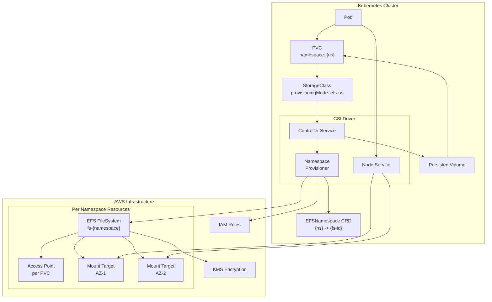
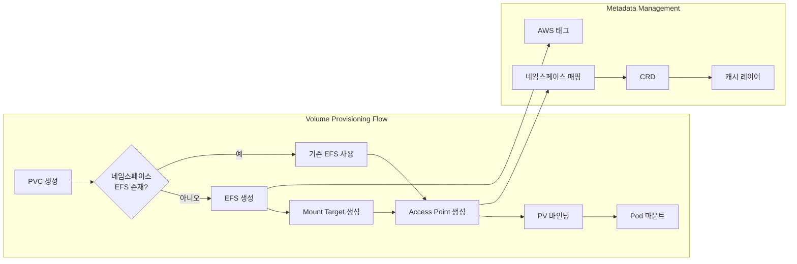
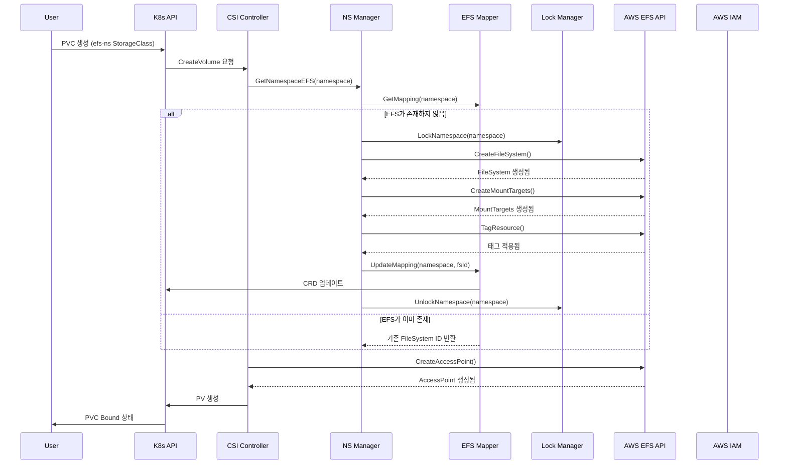
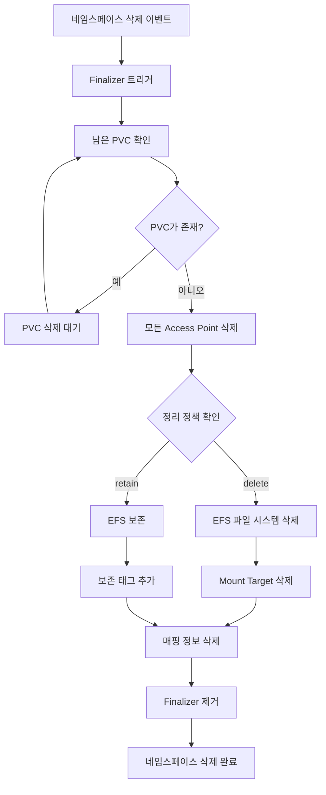
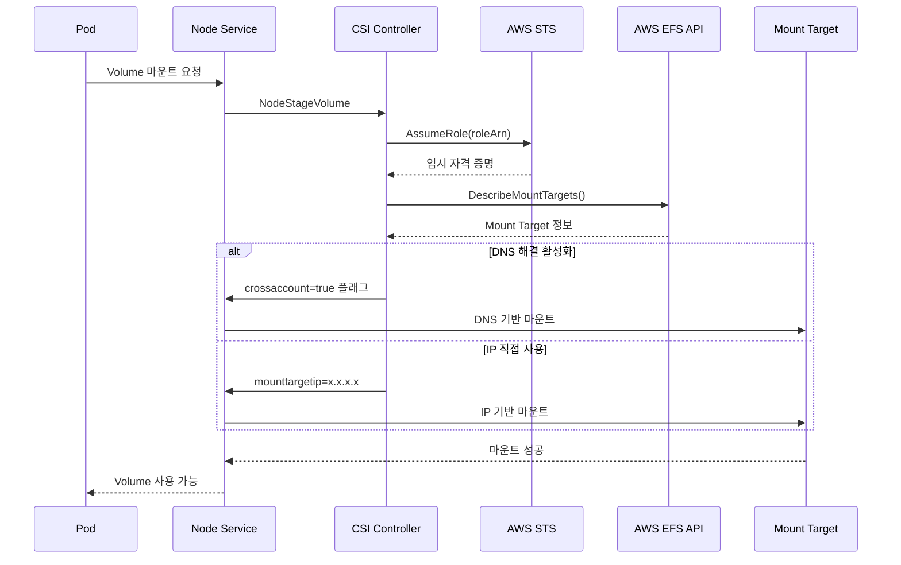
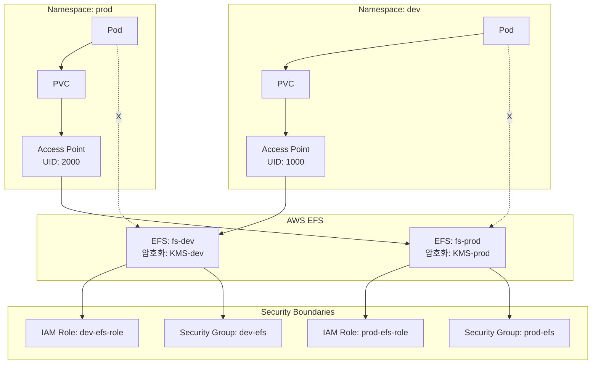
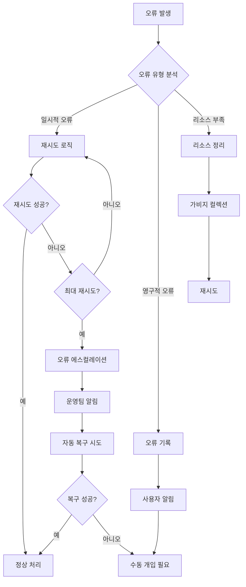
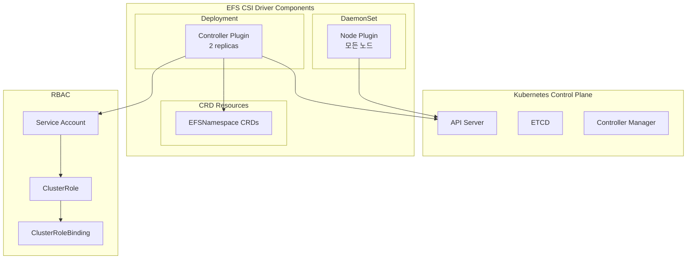
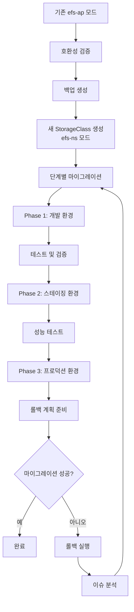
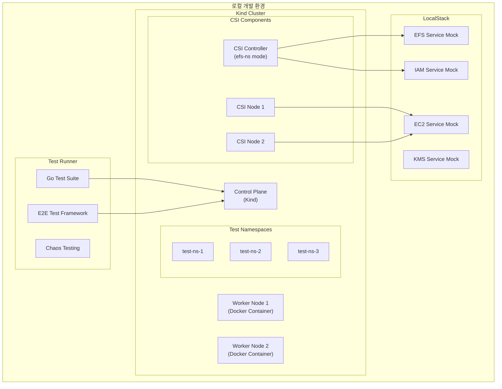

# EFS Namespace Provisioning Mode 설계 문서

## 1. 개요

### 1.1 설계 목표
본 문서는 AWS EFS CSI Driver에서 Kubernetes 네임스페이스별로 독립적인 EFS 파일 시스템을 자동으로 프로비저닝하는 `efs-ns` 모드의 기술 설계를 정의합니다. 이 모드는 기존 `efs-ap` 모드와 달리 네임스페이스별로 완전히 격리된 EFS 파일 시스템을 생성하여 더 강력한 멀티테넌시와 보안 격리를 제공합니다.

### 1.2 주요 설계 원칙
- **격리성**: 네임스페이스 간 완전한 데이터 격리
- **자동화**: EFS 파일 시스템의 자동 생성 및 관리
- **확장성**: 대규모 클러스터 환경 지원
- **호환성**: 기존 CSI Driver와의 완벽한 호환성
- **복원력**: 장애 시 자동 복구 메커니즘

## 2. 시스템 아키텍처

### 2.1 전체 아키텍처 다이어그램



### 2.2 데이터 플로우 다이어그램



## 3. 컴포넌트 설계

### 3.1 최소 변경 접근법 (Minimal Change Approach)

기존 CSI Driver의 구조를 최대한 유지하면서 새로운 기능을 추가하는 설계 원칙:

- **Driver 구조체 수정 없음**: 기존 Driver struct는 변경하지 않음
- **독립적 컴포넌트**: NamespaceProvisioner를 별도 컴포넌트로 구현
- **Controller 위임 패턴**: controller.go에서 provisioningMode 확인 후 적절한 로직으로 위임
- **CRD 기반 관리**: 프로덕션 환경을 위한 CRD 기반 네임스페이스 매핑 관리
- **기존 코드 재사용**: 가능한 모든 기존 로직과 유틸리티 재사용

이러한 접근법의 장점:
- 기존 코드베이스에 대한 영향 최소화
- 점진적 롤아웃 가능
- 롤백이 용이함
- 프로덕션 환경에 적합한 강력한 관리 기능
- 테스트 영향 최소화

### 3.2 NamespaceProvisioner - 독립 컴포넌트

```go
// pkg/driver/namespace_provisioner.go
// Driver struct 수정 없이 독립적으로 동작하는 컴포넌트

type NamespaceProvisioner struct {
    cloud           cloud.Cloud
    k8sClient      kubernetes.Interface
    mapper         *NamespaceEFSMapper
    lockManager    *LockManager
    cache          *EFSCache
    metrics        *MetricsCollector
}

// 독립적인 생성자 - Driver 수정 없음
func NewNamespaceProvisioner(cloud cloud.Cloud, k8sClient kubernetes.Interface) *NamespaceProvisioner {
    return &NamespaceProvisioner{
        cloud:       cloud,
        k8sClient:   k8sClient,
        mapper:      NewNamespaceEFSMapper(k8sClient),
        lockManager: NewLockManager(),
        cache:       NewEFSCache(),
        metrics:     NewMetricsCollector(),
    }
}

// 주요 인터페이스
type NamespaceProvisionerInterface interface {
    // EFS 파일 시스템 관리
    CreateNamespaceEFS(ctx context.Context, namespace string, options *EFSOptions) (*cloud.FileSystem, error)
    GetNamespaceEFS(ctx context.Context, namespace string) (*cloud.FileSystem, error)
    DeleteNamespaceEFS(ctx context.Context, namespace string) error

    // Access Point 관리
    CreateAccessPointForPVC(ctx context.Context, pvcName string, namespace string) (*cloud.AccessPoint, error)
    DeleteAccessPointForPVC(ctx context.Context, pvcName string, namespace string) error

    // Volume 생성 - controller.go에서 호출
    CreateNamespaceVolume(ctx context.Context, req *csi.CreateVolumeRequest) (*csi.CreateVolumeResponse, error)
    DeleteNamespaceVolume(ctx context.Context, req *csi.DeleteVolumeRequest) (*csi.DeleteVolumeResponse, error)
}
```

### 3.3 Namespace EFS Mapper (CRD 기반)

#### CRD를 사용하는 이유

프로덕션 환경에서 CRD는 다음과 같은 중요한 이점을 제공합니다:

1. **스키마 검증**: OpenAPI 스키마로 데이터 무결성 보장
2. **네이티브 kubectl 지원**: `kubectl get`, `describe`, `edit` 명령 사용 가능
3. **Watch/Events**: Informer를 통한 실시간 변경 감지
4. **Finalizers**: 안전한 삭제 프로세스 관리
5. **Status 서브리소스**: 상태 추적과 진행 상황 모니터링
6. **RBAC 통합**: 세밀한 권한 관리
7. **GitOps 호환성**: Argo CD, Flux 등과 완벽한 통합
8. **감사 로깅**: 모든 변경사항 자동 기록
9. **버전 관리**: 스키마 버전 관리 및 마이그레이션
10. **Webhook 지원**: 검증/변형 웹훅으로 고급 로직 구현

```go
// pkg/driver/namespace_mapper.go

type NamespaceEFSMapper struct {
    // CRD 클라이언트
    dynamicClient  dynamic.Interface
    crdClient      versioned.Interface  // generated client for CRD

    // 공통 기능
    cache          *sync.Map
    mutex          sync.RWMutex
    informer       cache.SharedInformer
}

// CRD 기반 매핑 구조체
type EFSNamespace struct {
    metav1.TypeMeta   `json:",inline"`
    metav1.ObjectMeta `json:"metadata,omitempty"`

    Spec   EFSNamespaceSpec   `json:"spec"`
    Status EFSNamespaceStatus `json:"status,omitempty"`
}

type EFSNamespaceSpec struct {
    Namespace        string                 `json:"namespace"`
    FileSystemId     string                 `json:"fileSystemId,omitempty"`
    Region          string                 `json:"region"`
    PerformanceMode string                 `json:"performanceMode,omitempty"`
    ThroughputMode  string                 `json:"throughputMode,omitempty"`
    Encrypted       bool                   `json:"encrypted,omitempty"`
    KmsKeyId        string                 `json:"kmsKeyId,omitempty"`
    Tags            map[string]string      `json:"tags,omitempty"`
    CleanupPolicy   string                 `json:"cleanupPolicy,omitempty"`
}

type EFSNamespaceStatus struct {
    State           string                 `json:"state"` // provisioning, active, deleting, failed
    FileSystemId    string                 `json:"fileSystemId,omitempty"`
    AccessPoints    []AccessPointReference `json:"accessPoints,omitempty"`
    LastUpdated     metav1.Time           `json:"lastUpdated,omitempty"`
    Message         string                 `json:"message,omitempty"`
    Conditions      []EFSCondition        `json:"conditions,omitempty"`
}

type EFSCondition struct {
    Type               string      `json:"type"`
    Status             string      `json:"status"`
    LastTransitionTime metav1.Time `json:"lastTransitionTime"`
    Reason            string      `json:"reason,omitempty"`
    Message           string      `json:"message,omitempty"`
}
```

#### CRD 클라이언트 구현 예시

```go
// pkg/driver/namespace_mapper_crd.go

func NewNamespaceEFSMapper(config *rest.Config) (*NamespaceEFSMapper, error) {
    mapper := &NamespaceEFSMapper{
        cache: &sync.Map{},
    }

    // CRD 클라이언트 초기화
    crdClient, err := versioned.NewForConfig(config)
    if err != nil {
        return nil, fmt.Errorf("failed to create CRD client: %w", err)
    }
    mapper.crdClient = crdClient

    // Informer 설정으로 실시간 변경 감지
    factory := externalversions.NewSharedInformerFactory(crdClient, 30*time.Second)
    informer := factory.Efs().V1alpha1().EFSNamespaces().Informer()

    informer.AddEventHandler(cache.ResourceEventHandlerFuncs{
        AddFunc:    mapper.handleAdd,
        UpdateFunc: mapper.handleUpdate,
        DeleteFunc: mapper.handleDelete,
    })

    mapper.informer = informer
    go factory.Start(wait.NeverStop)

    return mapper, nil
}

// CRD 기반 매핑 생성/업데이트
func (m *NamespaceEFSMapper) CreateOrUpdateMapping(namespace string, fsId string, opts *EFSOptions) error {
    // CRD 사용
    efsNamespace := &v1alpha1.EFSNamespace{
        ObjectMeta: metav1.ObjectMeta{
            Name: fmt.Sprintf("%s-efs", namespace),
            Finalizers: []string{"efs.csi.aws.com/cleanup"},  // 안전한 삭제 보장
        },
        Spec: v1alpha1.EFSNamespaceSpec{
            Namespace:       namespace,
            FileSystemId:    fsId,
            Region:          opts.Region,
            PerformanceMode: opts.PerformanceMode,
            ThroughputMode:  opts.ThroughputMode,
            Encrypted:       opts.Encrypted,
            KmsKeyId:        opts.KmsKeyId,
            CleanupPolicy:   opts.CleanupPolicy,
            Tags:            opts.Tags,
        },
    }

    // Create or Update
    existing, err := m.crdClient.EfsV1alpha1().EFSNamespaces().Get(
        context.TODO(), efsNamespace.Name, metav1.GetOptions{})

    if err != nil && !errors.IsNotFound(err) {
        return err
    }

    if errors.IsNotFound(err) {
        // Create new
        _, err = m.crdClient.EfsV1alpha1().EFSNamespaces().Create(
            context.TODO(), efsNamespace, metav1.CreateOptions{})
    } else {
        // Update existing
        existing.Spec = efsNamespace.Spec
        _, err = m.crdClient.EfsV1alpha1().EFSNamespaces().Update(
            context.TODO(), existing, metav1.UpdateOptions{})
    }

    return err
}

// Status 업데이트 (CRD의 Status subresource)
func (m *NamespaceEFSMapper) UpdateStatus(namespace string, state string, message string) error {
    efsNs, err := m.crdClient.EfsV1alpha1().EFSNamespaces().Get(
        context.TODO(), fmt.Sprintf("%s-efs", namespace), metav1.GetOptions{})
    if err != nil {
        return err
    }

    // Status 서브리소스 업데이트 - Spec 변경과 독립적
    efsNs.Status.State = state
    efsNs.Status.Message = message
    efsNs.Status.LastUpdated = metav1.Now()

    // Condition 추가
    condition := v1alpha1.EFSCondition{
        Type:               "Ready",
        Status:             "True",
        LastTransitionTime: metav1.Now(),
        Reason:            "Provisioned",
        Message:           message,
    }
    efsNs.Status.Conditions = updateCondition(efsNs.Status.Conditions, condition)

    _, err = m.crdClient.EfsV1alpha1().EFSNamespaces().UpdateStatus(
        context.TODO(), efsNs, metav1.UpdateOptions{})
    return err
}
```

### 3.4 EFS Lifecycle Manager

```go
// pkg/driver/efs_lifecycle.go

type EFSLifecycleManager struct {
    cloud           cloud.Cloud
    cleanupPolicy   CleanupPolicy
    retentionPeriod time.Duration
    gcInterval      time.Duration
}

type CleanupPolicy string

const (
    CleanupPolicyDelete CleanupPolicy = "delete"
    CleanupPolicyRetain CleanupPolicy = "retain"
)

// 생명주기 관리 인터페이스
type LifecycleManager interface {
    // 가비지 컬렉션
    StartGarbageCollection(ctx context.Context) error
    StopGarbageCollection()

    // 정리 정책 적용
    ApplyCleanupPolicy(ctx context.Context, namespace string) error

    // 고아 리소스 감지 및 정리
    DetectOrphanResources(ctx context.Context) ([]*OrphanResource, error)
    CleanupOrphanResources(ctx context.Context, resources []*OrphanResource) error
}
```

### 3.5 Lock Manager 확장

```go
// pkg/driver/ns_lock_manager.go

type NamespaceLockManager struct {
    *LockManager
    distributedLock DistributedLock
}

// 분산 락 인터페이스
type DistributedLock interface {
    AcquireLock(key string, ttl time.Duration) (bool, error)
    ReleaseLock(key string) error
    RenewLock(key string, ttl time.Duration) error
}

// 네임스페이스 수준 락
func (m *NamespaceLockManager) LockNamespace(namespace string, timeout time.Duration) bool
func (m *NamespaceLockManager) UnlockNamespace(namespace string)

// EFS 수준 락
func (m *NamespaceLockManager) LockEFS(fsId string, timeout time.Duration) bool
func (m *NamespaceLockManager) UnlockEFS(fsId string)
```

## 4. 데이터 모델

### 4.1 StorageClass 파라미터 확장

```yaml
apiVersion: storage.k8s.io/v1
kind: StorageClass
metadata:
  name: efs-ns-sc
provisioner: efs.csi.aws.com
parameters:
  provisioningMode: "efs-ns"              # 필수: 네임스페이스 모드 활성화

  # EFS 생성 파라미터
  performanceMode: "generalPurpose"       # generalPurpose | maxIO
  throughputMode: "bursting"              # bursting | provisioned | elastic
  provisionedThroughputInMibps: "100"     # throughputMode=provisioned일 때
  encrypted: "true"                       # 암호화 활성화
  kmsKeyId: "arn:aws:kms:..."            # KMS 키 ID
  lifecyclePolicy: "AFTER_30_DAYS"       # 수명 주기 정책
  backupPolicy: "ENABLED"                 # 백업 정책

  # Access Point 파라미터
  directoryPerms: "700"
  uid: "1000"
  gid: "1000"
  gidRangeStart: "50000"
  gidRangeEnd: "51000"
  basePath: "/dynamic_provisioning"
  subPathPattern: "${.PVC.namespace}/${.PVC.name}"
  ensureUniqueDirectory: "true"

  # 정리 정책
  cleanupPolicy: "retain"                 # retain | delete
  retentionPeriod: "7d"                  # 보존 기간

  # 크로스 계정 지원
  az: "us-west-2a"                       # 크로스 계정 마운트용

  # 태그
  tags: |
    Environment=Production
    Team=DevOps
    CostCenter=Engineering
```

### 4.2 Custom Resource Definition (CRD)

#### 프로덕션 환경에서 CRD의 이점

엔터프라이즈급 프로덕션 환경에서 CRD는 운영 관점에서 필수적인 기능들을 제공합니다:

**운영 가시성 향상**
- `kubectl get efsnamespaces` - 모든 네임스페이스 매핑 한눈에 확인
- `kubectl describe efsnamespace dev` - 상세 상태 및 이벤트 확인
- `kubectl get efsnamespace -w` - 실시간 상태 변경 모니터링

**강력한 관리 기능**
- **Finalizers**: 네임스페이스 삭제 시 안전한 정리 프로세스 보장
- **Status Subresource**: Controller가 Spec과 Status를 독립적으로 관리
- **Validation Webhook**: 잘못된 설정 사전 차단
- **Defaulting Webhook**: 기본값 자동 설정

**GitOps 및 자동화**
- Argo CD, Flux와 완벽한 통합
- Terraform, Pulumi 등 IaC 도구 지원
- CI/CD 파이프라인에서 직접 관리

```yaml
apiVersion: apiextensions.k8s.io/v1
kind: CustomResourceDefinition
metadata:
  name: efsnamespaces.efs.csi.aws.com
spec:
  group: efs.csi.aws.com
  versions:
  - name: v1alpha1
    served: true
    storage: true
    subresources:
      status: {}  # Status 서브리소스 활성화
    schema:
      openAPIV3Schema:
        type: object
        properties:
          spec:
            type: object
            required: ["namespace", "region"]
            properties:
              namespace:
                type: string
                pattern: "^[a-z0-9]([-a-z0-9]*[a-z0-9])?$"
              region:
                type: string
                pattern: "^[a-z]{2}-[a-z]+-[0-9]{1}$"
              fileSystemId:
                type: string
                pattern: "^fs-[0-9a-f]+$"
              performanceMode:
                type: string
                enum: ["generalPurpose", "maxIO"]
                default: "generalPurpose"
              throughputMode:
                type: string
                enum: ["bursting", "provisioned", "elastic"]
                default: "bursting"
              encrypted:
                type: boolean
                default: true
              kmsKeyId:
                type: string
              cleanupPolicy:
                type: string
                enum: ["delete", "retain"]
                default: "retain"
              tags:
                type: object
                additionalProperties:
                  type: string
          status:
            type: object
            properties:
              state:
                type: string
                enum: ["provisioning", "active", "deleting", "failed"]
              fileSystemId:
                type: string
              accessPoints:
                type: array
                items:
                  type: object
                  properties:
                    id:
                      type: string
                    pvcName:
                      type: string
              conditions:
                type: array
                items:
                  type: object
                  properties:
                    type:
                      type: string
                    status:
                      type: string
                    lastTransitionTime:
                      type: string
                    reason:
                      type: string
                    message:
                      type: string
              lastUpdated:
                type: string
              message:
                type: string
  scope: Cluster
  names:
    plural: efsnamespaces
    singular: efsnamespace
    kind: EFSNamespace
    shortNames:
    - efsns
    categories:
    - storage
```

#### CRD 사용 예시

```yaml
# 생성 예시
apiVersion: efs.csi.aws.com/v1alpha1
kind: EFSNamespace
metadata:
  name: dev-namespace-efs
spec:
  namespace: dev
  region: us-west-2
  performanceMode: generalPurpose
  throughputMode: elastic
  encrypted: true
  kmsKeyId: "arn:aws:kms:us-west-2:111122223333:key/1234abcd-12ab-34cd-56ef-1234567890ab"
  cleanupPolicy: retain
  tags:
    Environment: Development
    Team: Platform
    CostCenter: Engineering
```

## 5. 비즈니스 프로세스

### 5.1 PVC 생성 및 EFS 프로비저닝 프로세스



### 5.2 네임스페이스 삭제 및 정리 프로세스



### 5.3 크로스 계정 마운트 프로세스



## 6. 보안 아키텍처

### 6.1 네임스페이스 격리 메커니즘



### 6.2 IAM 권한 모델

```json
{
  "Version": "2012-10-17",
  "Statement": [
    {
      "Sid": "EFSNamespaceProvisioningPermissions",
      "Effect": "Allow",
      "Action": [
        "elasticfilesystem:CreateFileSystem",
        "elasticfilesystem:DeleteFileSystem",
        "elasticfilesystem:DescribeFileSystems",
        "elasticfilesystem:CreateMountTarget",
        "elasticfilesystem:DeleteMountTarget",
        "elasticfilesystem:DescribeMountTargets",
        "elasticfilesystem:CreateAccessPoint",
        "elasticfilesystem:DeleteAccessPoint",
        "elasticfilesystem:DescribeAccessPoints",
        "elasticfilesystem:TagResource",
        "elasticfilesystem:UntagResource",
        "elasticfilesystem:ListTagsForResource",
        "elasticfilesystem:PutLifecycleConfiguration",
        "elasticfilesystem:PutBackupPolicy"
      ],
      "Resource": "*",
      "Condition": {
        "StringEquals": {
          "aws:RequestTag/kubernetes.io/cluster/${CLUSTER_NAME}": "owned",
          "aws:RequestTag/kubernetes.io/provisioning-mode": "efs-ns"
        }
      }
    },
    {
      "Sid": "KMSPermissions",
      "Effect": "Allow",
      "Action": [
        "kms:CreateGrant",
        "kms:DescribeKey",
        "kms:GenerateDataKeyWithoutPlaintext"
      ],
      "Resource": "arn:aws:kms:${REGION}:${ACCOUNT}:key/*",
      "Condition": {
        "StringEquals": {
          "kms:ViaService": "elasticfilesystem.${REGION}.amazonaws.com"
        }
      }
    },
    {
      "Sid": "EC2Permissions",
      "Effect": "Allow",
      "Action": [
        "ec2:DescribeSubnets",
        "ec2:DescribeNetworkInterfaces",
        "ec2:DescribeSecurityGroups"
      ],
      "Resource": "*"
    }
  ]
}
```

### 6.3 암호화 전략

```yaml
encryptionStrategy:
  atRest:
    enabled: true
    kmsKeyPolicy:
      perNamespace: true        # 네임스페이스별 KMS 키 사용
      keyRotation: true         # 자동 키 로테이션
      keyAlias: "alias/efs-ns-${namespace}"

  inTransit:
    enabled: true
    tlsVersion: "1.2"          # 최소 TLS 버전
    mountOptions:
      - tls
      - iam
```

## 7. 성능 최적화 전략

### 7.1 캐싱 계층

```go
// pkg/driver/cache.go

type EFSCache struct {
    namespaceCache *lru.Cache    // LRU 캐시
    ttl            time.Duration
    maxSize        int
}

type CacheEntry struct {
    FileSystemId   string
    AccessPoints   []string
    LastUpdated    time.Time
    TTL           time.Duration
}

// 캐싱 전략
const (
    DefaultCacheTTL  = 5 * time.Minute
    MaxCacheSize     = 1000
    CacheHitMetric   = "efs_cache_hit_total"
    CacheMissMetric  = "efs_cache_miss_total"
)
```

### 7.2 병렬 처리 최적화

```go
// pkg/driver/parallel_processor.go

type ParallelProcessor struct {
    workerPool   *WorkerPool
    maxWorkers   int
    taskQueue    chan Task
    resultQueue  chan Result
}

func (p *ParallelProcessor) ProcessPVCRequests(requests []*PVCRequest) error {
    var wg sync.WaitGroup
    semaphore := make(chan struct{}, p.maxWorkers)

    for _, req := range requests {
        wg.Add(1)
        semaphore <- struct{}{}

        go func(request *PVCRequest) {
            defer wg.Done()
            defer func() { <-semaphore }()

            p.processSingleRequest(request)
        }(req)
    }

    wg.Wait()
    return nil
}
```

### 7.3 성능 메트릭

```yaml
performanceMetrics:
  provisioning:
    - efs_creation_duration_seconds       # EFS 생성 시간
    - access_point_creation_duration_seconds  # AP 생성 시간
    - mount_target_ready_duration_seconds # Mount Target 준비 시간

  throughput:
    - efs_read_throughput_mbps           # 읽기 처리량
    - efs_write_throughput_mbps          # 쓰기 처리량
    - efs_metadata_ops_per_second        # 메타데이터 작업/초

  availability:
    - efs_availability_percentage        # 가용성 비율
    - mount_success_rate                 # 마운트 성공률
    - api_call_success_rate             # API 호출 성공률
```

## 8. 오류 처리 및 복구 메커니즘

### 8.1 재시도 전략

```go
// pkg/driver/retry_strategy.go

type RetryConfig struct {
    MaxRetries     int
    InitialDelay   time.Duration
    MaxDelay       time.Duration
    BackoffFactor  float64
    JitterFactor   float64
}

var defaultRetryConfig = RetryConfig{
    MaxRetries:    5,
    InitialDelay:  1 * time.Second,
    MaxDelay:      30 * time.Second,
    BackoffFactor: 2.0,
    JitterFactor:  0.1,
}

// 재시도 가능한 오류 분류
func isRetryableError(err error) bool {
    switch {
    case isThrottlingError(err):
        return true
    case isTimeoutError(err):
        return true
    case isNetworkError(err):
        return true
    case isServiceUnavailable(err):
        return true
    default:
        return false
    }
}
```

### 8.2 오류 복구 워크플로우



### 8.3 상태 일관성 보장

```go
// pkg/driver/consistency.go

type ConsistencyChecker struct {
    k8sClient kubernetes.Interface
    awsClient cloud.Cloud
    interval  time.Duration
}

func (c *ConsistencyChecker) ReconcileState(ctx context.Context) error {
    // 1. K8s 상태 수집
    k8sState, err := c.collectK8sState(ctx)
    if err != nil {
        return err
    }

    // 2. AWS 상태 수집
    awsState, err := c.collectAWSState(ctx)
    if err != nil {
        return err
    }

    // 3. 불일치 감지
    discrepancies := c.detectDiscrepancies(k8sState, awsState)

    // 4. 불일치 해결
    for _, disc := range discrepancies {
        if err := c.resolveDiscrepancy(ctx, disc); err != nil {
            klog.Errorf("Failed to resolve discrepancy: %v", err)
        }
    }

    return nil
}
```

## 9. 통합 지점

### 9.1 Controller Service 통합 (Driver 구조체 수정 없음)

```go
// pkg/driver/controller.go - 기존 파일에 위임 로직 추가
// Driver struct는 전혀 수정하지 않음

// 전역 변수로 namespace provisioner 인스턴스 관리
var namespaceProvisioner *NamespaceProvisioner

// InitializeNamespaceProvisioner - main.go 또는 초기화 시점에 호출
func InitializeNamespaceProvisioner(cloud cloud.Cloud, k8sClient kubernetes.Interface) {
    if namespaceProvisioner == nil {
        namespaceProvisioner = NewNamespaceProvisioner(cloud, k8sClient)
    }
}

// CreateVolume 메서드 - 기존 메서드 수정
func (d *Driver) CreateVolume(ctx context.Context, req *csi.CreateVolumeRequest) (*csi.CreateVolumeResponse, error) {
    // 파라미터에서 provisioning mode 확인
    provisioningMode := req.GetParameters()[ProvisioningMode]

    // 모드에 따라 적절한 로직으로 위임
    switch provisioningMode {
    case "efs-ns":
        // efs-ns 모드: 별도 provisioner로 위임
        if namespaceProvisioner == nil {
            // lazy initialization
            InitializeNamespaceProvisioner(d.cloud, d.k8sClient)
        }
        return namespaceProvisioner.CreateNamespaceVolume(ctx, req)

    case "efs-ap", "":
        // 기존 efs-ap 모드 (기본값)
        // 기존 로직 그대로 사용
        return d.createAccessPointVolume(ctx, req)

    default:
        return nil, status.Errorf(codes.InvalidArgument, "Invalid provisioning mode: %s", provisioningMode)
    }
}

// DeleteVolume 메서드 - 동일한 패턴으로 수정
func (d *Driver) DeleteVolume(ctx context.Context, req *csi.DeleteVolumeRequest) (*csi.DeleteVolumeResponse, error) {
    // Volume ID에서 모드 추출 (예: efs-ns-fs-xxx 형식)
    if strings.HasPrefix(req.GetVolumeId(), "efs-ns-") {
        if namespaceProvisioner == nil {
            InitializeNamespaceProvisioner(d.cloud, d.k8sClient)
        }
        return namespaceProvisioner.DeleteNamespaceVolume(ctx, req)
    }

    // 기존 로직 사용
    return d.deleteAccessPointVolume(ctx, req)
}

// 기존 Driver struct와 메서드는 전혀 수정하지 않음
// 모든 efs-ns 관련 로직은 NamespaceProvisioner에서 처리
```

### 9.2 Kubernetes API 통합

```go
// pkg/driver/k8s_integration.go

type K8sIntegration struct {
    client         kubernetes.Interface
    dynamicClient  dynamic.Interface
    informerFactory informers.SharedInformerFactory
}

// 네임스페이스 워치
func (k *K8sIntegration) WatchNamespaces(ctx context.Context) {
    nsInformer := k.informerFactory.Core().V1().Namespaces()

    nsInformer.Informer().AddEventHandler(cache.ResourceEventHandlerFuncs{
        AddFunc: func(obj interface{}) {
            ns := obj.(*v1.Namespace)
            klog.Infof("Namespace created: %s", ns.Name)
        },
        DeleteFunc: func(obj interface{}) {
            ns := obj.(*v1.Namespace)
            klog.Infof("Namespace deleted: %s", ns.Name)
            // Trigger cleanup process
        },
    })

    k.informerFactory.Start(ctx.Done())
}

// Finalizer 관리
func (k *K8sIntegration) AddFinalizer(namespace string) error {
    // Finalizer 추가 로직
    return nil
}

func (k *K8sIntegration) RemoveFinalizer(namespace string) error {
    // Finalizer 제거 로직
    return nil
}
```

## 10. 배포 아키텍처

### 10.1 배포 다이어그램



## 11. CRD 운영 이점

### 11.1 운영 가시성

CRD를 사용하면 운영팀이 EFS 네임스페이스 매핑을 쉽게 관리하고 모니터링할 수 있습니다:

```bash
# 모든 네임스페이스 매핑 조회
kubectl get efsnamespaces
NAME                 NAMESPACE   FILESYSTEM-ID         STATE    AGE
dev-namespace-efs    dev         fs-0123456789abcdef0  active   10d
prod-namespace-efs   prod        fs-0123456789abcdef1  active   30d
staging-namespace    staging     fs-0123456789abcdef2  provisioning  2m

# 특정 매핑 상세 정보
kubectl describe efsnamespace dev-namespace-efs
Name:         dev-namespace-efs
Namespace:
Labels:       <none>
Annotations:  <none>
API Version:  efs.csi.aws.com/v1alpha1
Kind:         EFSNamespace
Metadata:
  Creation Timestamp:  2024-01-15T10:30:00Z
  Finalizers:
    efs.csi.aws.com/cleanup
Spec:
  Namespace:        dev
  Region:          us-west-2
  Performance Mode: generalPurpose
  Throughput Mode:  elastic
  Encrypted:       true
  KMS Key ID:      arn:aws:kms:us-west-2:111122223333:key/1234abcd
  Cleanup Policy:  retain
Status:
  State:           active
  File System ID:  fs-0123456789abcdef0
  Access Points:
    - ID: fsap-1234567890abcdef0
      PVC Name: data-pvc-1
    - ID: fsap-1234567890abcdef1
      PVC Name: cache-pvc-2
  Conditions:
    Type:    Ready
    Status:  True
    Reason:  Provisioned
    Message: EFS filesystem successfully provisioned
  Last Updated: 2024-01-25T14:22:33Z
Events:
  Type    Reason                Age   From                     Message
  ----    ------                ----  ----                     -------
  Normal  FilesystemCreated     10d   efs-namespace-controller  EFS filesystem fs-0123456789abcdef0 created
  Normal  MountTargetsCreated   10d   efs-namespace-controller  Mount targets created in 2 subnets
  Normal  AccessPointCreated    10d   efs-namespace-controller  Access point fsap-1234567890abcdef0 created
```

### 11.2 RBAC 세밀한 권한 관리

```yaml
# CRD를 사용한 세밀한 권한 관리
apiVersion: rbac.authorization.k8s.io/v1
kind: Role
metadata:
  name: efs-namespace-viewer
  namespace: platform-team
rules:
- apiGroups: ["efs.csi.aws.com"]
  resources: ["efsnamespaces"]
  verbs: ["get", "list", "watch"]

---
apiVersion: rbac.authorization.k8s.io/v1
kind: Role
metadata:
  name: efs-namespace-admin
  namespace: platform-team
rules:
- apiGroups: ["efs.csi.aws.com"]
  resources: ["efsnamespaces"]
  verbs: ["*"]
- apiGroups: ["efs.csi.aws.com"]
  resources: ["efsnamespaces/status"]
  verbs: ["get", "update", "patch"]
```

### 11.3 Webhook을 통한 고급 검증

```go
// pkg/webhook/validation.go

func (v *EFSNamespaceValidator) ValidateCreate(ctx context.Context, obj runtime.Object) error {
    efsNs := obj.(*v1alpha1.EFSNamespace)

    // 네임스페이스 존재 확인
    _, err := v.k8sClient.CoreV1().Namespaces().Get(ctx, efsNs.Spec.Namespace, metav1.GetOptions{})
    if err != nil {
        return fmt.Errorf("namespace %s does not exist", efsNs.Spec.Namespace)
    }

    // 중복 매핑 방지
    existing, err := v.crdClient.EfsV1alpha1().EFSNamespaces().List(ctx, metav1.ListOptions{})
    if err == nil {
        for _, item := range existing.Items {
            if item.Spec.Namespace == efsNs.Spec.Namespace && item.Name != efsNs.Name {
                return fmt.Errorf("namespace %s already has an EFS mapping", efsNs.Spec.Namespace)
            }
        }
    }

    // AWS 리전 검증
    if !isValidRegion(efsNs.Spec.Region) {
        return fmt.Errorf("invalid AWS region: %s", efsNs.Spec.Region)
    }

    // KMS 키 검증 (암호화 활성화 시)
    if efsNs.Spec.Encrypted && efsNs.Spec.KmsKeyId != "" {
        if !isValidKMSKey(efsNs.Spec.KmsKeyId) {
            return fmt.Errorf("invalid KMS key: %s", efsNs.Spec.KmsKeyId)
        }
    }

    return nil
}
```

## 12. 모니터링 및 관찰성

### 12.1 메트릭 수집 아키텍처

```go
// pkg/driver/metrics.go

type MetricsCollector struct {
    registry *prometheus.Registry

    // Provisioning metrics
    efsCreationDuration      prometheus.Histogram
    apCreationDuration       prometheus.Histogram
    pvBindingDuration        prometheus.Histogram

    // Operational metrics
    namespaceMappingCount    prometheus.Gauge
    activeEFSCount          prometheus.Gauge
    activeAccessPointCount  prometheus.Gauge

    // Error metrics
    provisioningErrors      prometheus.Counter
    apiCallErrors          prometheus.Counter
    reconciliationErrors   prometheus.Counter
}

// Prometheus 메트릭 정의
var (
    efsCreationDuration = prometheus.NewHistogramVec(
        prometheus.HistogramOpts{
            Name: "efs_ns_creation_duration_seconds",
            Help: "Time taken to create EFS file system",
            Buckets: prometheus.ExponentialBuckets(1, 2, 10),
        },
        []string{"namespace", "status"},
    )
)
```

### 12.2 로깅 전략

```go
// pkg/driver/logging.go

type StructuredLogger struct {
    logger *zap.Logger
}

func (l *StructuredLogger) LogProvisioningEvent(event ProvisioningEvent) {
    l.logger.Info("Provisioning event",
        zap.String("namespace", event.Namespace),
        zap.String("pvcName", event.PVCName),
        zap.String("fileSystemId", event.FileSystemId),
        zap.String("accessPointId", event.AccessPointId),
        zap.Duration("duration", event.Duration),
        zap.String("status", event.Status),
        zap.Error(event.Error),
    )
}

// 감사 로그
type AuditLogger struct {
    auditLog *os.File
}

func (a *AuditLogger) LogSecurityEvent(event SecurityEvent) {
    // 보안 관련 이벤트 로깅
}
```

## 13. 테스트 전략

### 13.1 단위 테스트

```go
// pkg/driver/controller_efs_ns_test.go

func TestCreateNamespaceEFS(t *testing.T) {
    tests := []struct {
        name      string
        namespace string
        options   *EFSOptions
        mockSetup func(*mock_cloud.MockCloud)
        wantErr   bool
    }{
        {
            name:      "successful creation",
            namespace: "test-ns",
            options: &EFSOptions{
                PerformanceMode: "generalPurpose",
                Encrypted:       true,
            },
            mockSetup: func(m *mock_cloud.MockCloud) {
                m.EXPECT().CreateFileSystem(gomock.Any(), gomock.Any()).
                    Return(&cloud.FileSystem{FileSystemId: "fs-12345"}, nil)
            },
            wantErr: false,
        },
        // 추가 테스트 케이스
    }

    for _, tt := range tests {
        t.Run(tt.name, func(t *testing.T) {
            // 테스트 실행
        })
    }
}
```

### 13.2 통합 테스트

```go
// test/integration/efs_ns_test.go

func TestEndToEndProvisioning(t *testing.T) {
    // 1. StorageClass 생성
    sc := createEFSNamespaceStorageClass()

    // 2. PVC 생성
    pvc := createPVC(sc.Name, "test-namespace")

    // 3. PVC Bound 상태 확인
    waitForPVCBound(pvc)

    // 4. EFS 생성 확인
    verifyEFSCreated("test-namespace")

    // 5. Access Point 생성 확인
    verifyAccessPointCreated(pvc)

    // 6. Pod 생성 및 마운트 확인
    pod := createPodWithPVC(pvc)
    waitForPodReady(pod)

    // 7. 데이터 쓰기/읽기 테스트
    testDataReadWrite(pod)

    // 8. 정리
    cleanup(pod, pvc, sc)
}
```

### 13.3 성능 테스트

```yaml
# test/performance/load_test.yaml
apiVersion: batch/v1
kind: Job
metadata:
  name: efs-ns-load-test
spec:
  parallelism: 50
  completions: 1000
  template:
    spec:
      containers:
      - name: load-generator
        image: efs-load-test:latest
        env:
        - name: TEST_SCENARIO
          value: "namespace_provisioning"
        - name: CONCURRENT_NAMESPACES
          value: "50"
        - name: PVCS_PER_NAMESPACE
          value: "10"
```

## 14. 마이그레이션 계획

### 14.1 마이그레이션 워크플로우



### 14.2 마이그레이션 도구

```go
// tools/migration/migrator.go

type EFSMigrator struct {
    sourceMode      string
    targetMode      string
    k8sClient       kubernetes.Interface
    awsClient       cloud.Cloud
    backupManager   *BackupManager
}

func (m *EFSMigrator) MigrateNamespace(ctx context.Context, namespace string) error {
    // 1. 현재 상태 백업
    backup, err := m.backupManager.BackupNamespace(namespace)
    if err != nil {
        return err
    }

    // 2. 새 EFS 생성 (efs-ns 모드)
    newFS, err := m.createNamespaceEFS(ctx, namespace)
    if err != nil {
        return err
    }

    // 3. 데이터 마이그레이션
    err = m.migrateData(ctx, backup.SourceFS, newFS)
    if err != nil {
        return err
    }

    // 4. PVC 업데이트
    err = m.updatePVCs(ctx, namespace, newFS)
    if err != nil {
        return err
    }

    // 5. 검증
    return m.validateMigration(ctx, namespace)
}
```

## 15. 구성 관리

### 15.1 구현 전략 - 최소 변경 원칙

#### 15.1 단계별 구현 계획

**Phase 1: 기본 구조 구축 (영향도: 최소)**
1. `namespace_provisioner.go` 파일 생성
2. CRD 정의 및 클라이언트 코드 생성
3. CRD 기반 mapper 구현
4. 단위 테스트 작성
5. 기존 코드는 전혀 수정하지 않음

**Phase 2: Controller 통합 (영향도: 낮음)**
1. `controller.go`에 조건문 추가 (5-10줄)
2. provisioning mode 파라미터 확인 로직
3. namespace provisioner로 위임
4. 기존 efs-ap 로직은 그대로 유지

**Phase 3: 점진적 롤아웃 (영향도: 없음)**
1. 새 StorageClass 생성 (efs-ns 모드)
2. 테스트 네임스페이스에서 검증
3. 기존 워크로드는 영향 없음
4. 문제 발생 시 StorageClass만 변경하면 롤백

#### 15.2 코드 변경 최소화 전략

```go
// 변경이 필요한 파일들과 예상 변경 라인 수

// 1. controller.go - 약 20줄 추가
// - CreateVolume 메서드에 조건문 추가 (10줄)
// - DeleteVolume 메서드에 조건문 추가 (10줄)

// 2. 새로운 파일들 (기존 코드 영향 없음)
// - namespace_provisioner.go (신규)
// - namespace_mapper.go (신규)
// - namespace_provisioner_test.go (신규)

// 기존 Driver struct - 변경 없음
// 기존 테스트 - 영향 없음
// 기존 배포 - 영향 없음
```

## 16. 성공 지표 및 모니터링 KPI

### 16.1 핵심 성능 지표 (KPI)

| 지표 | 목표 | 측정 방법 |
|------|------|----------|
| EFS 프로비저닝 시간 | < 5분 | `efs_ns_creation_duration_seconds` |
| Access Point 생성 시간 | < 30초 | `ap_creation_duration_seconds` |
| PVC 바인딩 성공률 | > 99% | `pvc_binding_success_rate` |
| 네임스페이스 격리 위반 | 0 | Security audit logs |
| API 호출 성공률 | > 99.9% | `aws_api_success_rate` |
| 시스템 가용성 | > 99.9% | `system_availability_percentage` |
| 고아 리소스 | < 1% | `orphan_resources_count` |

## 17. 로컬 통합 테스트 전략

### 17.1 테스트 환경 아키텍처



### 17.2 Kind 클러스터 구성

#### 17.2.1 Kind 클러스터 설정 파일

```yaml
# test/kind-config.yaml
kind: Cluster
apiVersion: kind.x-k8s.io/v1alpha4
name: efs-ns-test
nodes:
  - role: control-plane
    image: kindest/node:v1.27.3
    extraMounts:
      - hostPath: ./test/localstack-data
        containerPath: /localstack-data
  - role: worker
    image: kindest/node:v1.27.3
    extraMounts:
      - hostPath: ./test/localstack-data
        containerPath: /localstack-data
  - role: worker
    image: kindest/node:v1.27.3
    extraMounts:
      - hostPath: ./test/localstack-data
        containerPath: /localstack-data
networking:
  apiServerAddress: "127.0.0.1"
  apiServerPort: 6443
  podSubnet: "10.244.0.0/16"
  serviceSubnet: "10.96.0.0/12"
featureGates:
  CSIStorageCapacity: true
  ExpandCSIVolumes: true
  ExpandInUsePersistentVolumes: true
```

#### 17.2.2 Kind 클러스터 초기화 스크립트

```bash
#!/bin/bash
# test/scripts/setup-kind.sh

set -euo pipefail

CLUSTER_NAME="efs-ns-test"
SCRIPT_DIR="$( cd "$( dirname "${BASH_SOURCE[0]}" )" && pwd )"
ROOT_DIR="$(dirname "$(dirname "$SCRIPT_DIR")")"

echo "🔧 Creating Kind cluster for EFS-NS testing..."

# 클러스터 삭제 (존재하는 경우)
kind delete cluster --name ${CLUSTER_NAME} 2>/dev/null || true

# 클러스터 생성
kind create cluster --config="${SCRIPT_DIR}/../kind-config.yaml"

# kubectl context 설정
kubectl cluster-info --context kind-${CLUSTER_NAME}

echo "✅ Kind cluster created successfully"

# CRD 설치
echo "📦 Installing EFSNamespace CRD..."
kubectl apply -f "${ROOT_DIR}/deploy/kubernetes/base/crd-efsnamespace.yaml"

# RBAC 설정
echo "🔐 Setting up RBAC..."
kubectl apply -f "${ROOT_DIR}/deploy/kubernetes/base/rbac-csi-driver.yaml"

echo "✅ Kind cluster setup complete"
```

### 17.3 LocalStack 구성

#### 18.3.1 LocalStack Docker Compose 설정

```yaml
# test/docker-compose-localstack.yaml
version: '3.8'

services:
  localstack:
    container_name: localstack-efs-test
    image: localstack/localstack:2.3.0
    ports:
      - "4566:4566"  # LocalStack 게이트웨이
      - "4510-4559:4510-4559"  # 외부 서비스 포트
    environment:
      - SERVICES=efs,ec2,iam,sts,kms
      - DEBUG=1
      - DOCKER_HOST=unix:///var/run/docker.sock
      - LOCALSTACK_HOST=localhost.localstack.cloud
      - AWS_ACCESS_KEY_ID=test
      - AWS_SECRET_ACCESS_KEY=test
      - AWS_DEFAULT_REGION=us-east-1
      - PERSISTENCE=1
      - PERSIST_ALL=true
    volumes:
      - "./localstack-data:/var/lib/localstack"
      - "/var/run/docker.sock:/var/run/docker.sock"
    networks:
      - kind

networks:
  kind:
    external: true
    name: kind
```

#### 18.3.2 LocalStack 초기화 스크립트

```bash
#!/bin/bash
# test/scripts/setup-localstack.sh

set -euo pipefail

echo "🚀 Starting LocalStack for AWS service mocking..."

# LocalStack 시작
docker-compose -f test/docker-compose-localstack.yaml up -d

# LocalStack 준비 대기
echo "⏳ Waiting for LocalStack to be ready..."
timeout 60 bash -c 'until curl -s http://localhost:4566/_localstack/health | grep -q "running"; do sleep 1; done'

# AWS CLI 설정
export AWS_ACCESS_KEY_ID=test
export AWS_SECRET_ACCESS_KEY=test
export AWS_DEFAULT_REGION=us-east-1
export AWS_ENDPOINT_URL=http://localhost:4566

# VPC 및 서브넷 생성
echo "🌐 Creating VPC and subnets..."
VPC_ID=$(aws ec2 create-vpc --cidr-block 10.0.0.0/16 --query 'Vpc.VpcId' --output text)
SUBNET1_ID=$(aws ec2 create-subnet --vpc-id $VPC_ID --cidr-block 10.0.1.0/24 --availability-zone us-east-1a --query 'Subnet.SubnetId' --output text)
SUBNET2_ID=$(aws ec2 create-subnet --vpc-id $VPC_ID --cidr-block 10.0.2.0/24 --availability-zone us-east-1b --query 'Subnet.SubnetId' --output text)

# 보안 그룹 생성
SG_ID=$(aws ec2 create-security-group --group-name efs-test-sg --description "EFS Test Security Group" --vpc-id $VPC_ID --query 'GroupId' --output text)
aws ec2 authorize-security-group-ingress --group-id $SG_ID --protocol tcp --port 2049 --cidr 10.0.0.0/16

# KMS 키 생성
KMS_KEY_ID=$(aws kms create-key --description "EFS Test Encryption Key" --query 'KeyMetadata.KeyId' --output text)
aws kms create-alias --alias-name alias/efs-test --target-key-id $KMS_KEY_ID

echo "✅ LocalStack setup complete"
echo "VPC_ID: $VPC_ID"
echo "SUBNET_IDS: $SUBNET1_ID,$SUBNET2_ID"
echo "SECURITY_GROUP_ID: $SG_ID"
echo "KMS_KEY_ID: $KMS_KEY_ID"

# 환경 변수 파일 생성
cat > test/.env.localstack <<EOF
export AWS_ENDPOINT_URL=http://localhost:4566
export VPC_ID=$VPC_ID
export SUBNET_IDS=$SUBNET1_ID,$SUBNET2_ID
export SECURITY_GROUP_ID=$SG_ID
export KMS_KEY_ID=$KMS_KEY_ID
EOF
```

### 18.4 통합 테스트 구현

#### 18.4.1 테스트 설정 헬퍼

```go
// test/integration/helper.go
package integration

import (
    "context"
    "fmt"
    "os"
    "testing"
    "time"

    "github.com/aws/aws-sdk-go/aws"
    "github.com/aws/aws-sdk-go/aws/session"
    "github.com/aws/aws-sdk-go/service/efs"
    v1 "k8s.io/api/core/v1"
    storagev1 "k8s.io/api/storage/v1"
    "k8s.io/apimachinery/pkg/api/resource"
    metav1 "k8s.io/apimachinery/pkg/apis/meta/v1"
    "k8s.io/client-go/kubernetes"
    "k8s.io/client-go/tools/clientcmd"
)

type TestEnvironment struct {
    K8sClient    kubernetes.Interface
    EFSClient    *efs.EFS
    VpcID        string
    SubnetIDs    []string
    SecurityGroup string
    KmsKeyID     string
}

func SetupTestEnvironment(t *testing.T) *TestEnvironment {
    // Kubernetes 클라이언트 생성
    kubeconfig := os.Getenv("KUBECONFIG")
    if kubeconfig == "" {
        kubeconfig = os.Getenv("HOME") + "/.kube/config"
    }

    config, err := clientcmd.BuildConfigFromFlags("", kubeconfig)
    if err != nil {
        t.Fatalf("Failed to build kubeconfig: %v", err)
    }

    k8sClient, err := kubernetes.NewForConfig(config)
    if err != nil {
        t.Fatalf("Failed to create k8s client: %v", err)
    }

    // AWS 클라이언트 생성 (LocalStack 연결)
    sess := session.Must(session.NewSession(&aws.Config{
        Endpoint:         aws.String(os.Getenv("AWS_ENDPOINT_URL")),
        Region:           aws.String("us-east-1"),
        S3ForcePathStyle: aws.Bool(true),
    }))

    return &TestEnvironment{
        K8sClient:     k8sClient,
        EFSClient:     efs.New(sess),
        VpcID:         os.Getenv("VPC_ID"),
        SubnetIDs:     []string{os.Getenv("SUBNET1_ID"), os.Getenv("SUBNET2_ID")},
        SecurityGroup: os.Getenv("SECURITY_GROUP_ID"),
        KmsKeyID:      os.Getenv("KMS_KEY_ID"),
    }
}

func (te *TestEnvironment) CreateStorageClass(name string) error {
    sc := &storagev1.StorageClass{
        ObjectMeta: metav1.ObjectMeta{
            Name: name,
        },
        Provisioner: "efs.csi.aws.com",
        Parameters: map[string]string{
            "provisioningMode":     "efs-ns",
            "performanceMode":      "generalPurpose",
            "throughputMode":       "bursting",
            "encrypted":           "true",
            "kmsKeyId":            te.KmsKeyID,
            "vpcId":               te.VpcID,
            "subnetIds":           fmt.Sprintf("%s,%s", te.SubnetIDs[0], te.SubnetIDs[1]),
            "securityGroupId":     te.SecurityGroup,
        },
        ReclaimPolicy: &[]v1.PersistentVolumeReclaimPolicy{v1.PersistentVolumeReclaimDelete}[0],
        VolumeBindingMode: &[]storagev1.VolumeBindingMode{storagev1.VolumeBindingImmediate}[0],
    }

    _, err := te.K8sClient.StorageV1().StorageClasses().Create(
        context.Background(), sc, metav1.CreateOptions{})
    return err
}

func (te *TestEnvironment) CreateNamespace(name string) error {
    ns := &v1.Namespace{
        ObjectMeta: metav1.ObjectMeta{
            Name: name,
            Labels: map[string]string{
                "efs-ns-test": "true",
            },
        },
    }

    _, err := te.K8sClient.CoreV1().Namespaces().Create(
        context.Background(), ns, metav1.CreateOptions{})
    return err
}

func (te *TestEnvironment) CreatePVC(namespace, name, storageClass string) error {
    pvc := &v1.PersistentVolumeClaim{
        ObjectMeta: metav1.ObjectMeta{
            Name:      name,
            Namespace: namespace,
        },
        Spec: v1.PersistentVolumeClaimSpec{
            AccessModes: []v1.PersistentVolumeAccessMode{
                v1.ReadWriteMany,
            },
            StorageClassName: &storageClass,
            Resources: v1.ResourceRequirements{
                Requests: v1.ResourceList{
                    v1.ResourceStorage: resource.MustParse("1Gi"),
                },
            },
        },
    }

    _, err := te.K8sClient.CoreV1().PersistentVolumeClaims(namespace).Create(
        context.Background(), pvc, metav1.CreateOptions{})
    return err
}

func (te *TestEnvironment) WaitForPVCBound(namespace, name string, timeout time.Duration) error {
    ctx, cancel := context.WithTimeout(context.Background(), timeout)
    defer cancel()

    ticker := time.NewTicker(2 * time.Second)
    defer ticker.Stop()

    for {
        select {
        case <-ctx.Done():
            return fmt.Errorf("timeout waiting for PVC to be bound")
        case <-ticker.C:
            pvc, err := te.K8sClient.CoreV1().PersistentVolumeClaims(namespace).Get(
                context.Background(), name, metav1.GetOptions{})
            if err != nil {
                return err
            }
            if pvc.Status.Phase == v1.ClaimBound {
                return nil
            }
        }
    }
}
```

#### 18.4.2 핵심 기능 테스트

```go
// test/integration/efs_ns_test.go
package integration

import (
    "context"
    "fmt"
    "sync"
    "testing"
    "time"

    "github.com/stretchr/testify/assert"
    "github.com/stretchr/testify/require"
)

func TestSingleNamespaceSinglePVC(t *testing.T) {
    env := SetupTestEnvironment(t)

    // StorageClass 생성
    err := env.CreateStorageClass("efs-ns-test-sc")
    require.NoError(t, err)

    // 네임스페이스 생성
    nsName := fmt.Sprintf("test-ns-%d", time.Now().Unix())
    err = env.CreateNamespace(nsName)
    require.NoError(t, err)
    defer env.K8sClient.CoreV1().Namespaces().Delete(
        context.Background(), nsName, metav1.DeleteOptions{})

    // PVC 생성
    err = env.CreatePVC(nsName, "test-pvc", "efs-ns-test-sc")
    require.NoError(t, err)

    // PVC 바인딩 대기
    err = env.WaitForPVCBound(nsName, "test-pvc", 5*time.Minute)
    assert.NoError(t, err)

    // EFS 파일시스템 확인
    result, err := env.EFSClient.DescribeFileSystems(&efs.DescribeFileSystemsInput{})
    require.NoError(t, err)

    // 네임스페이스용 EFS 생성 확인
    found := false
    for _, fs := range result.FileSystems {
        for _, tag := range fs.Tags {
            if *tag.Key == "kubernetes.io/namespace" && *tag.Value == nsName {
                found = true
                break
            }
        }
    }
    assert.True(t, found, "EFS filesystem for namespace should be created")
}

func TestMultipleNamespacesIsolation(t *testing.T) {
    env := SetupTestEnvironment(t)

    // StorageClass 생성
    err := env.CreateStorageClass("efs-ns-isolation-sc")
    require.NoError(t, err)

    // 여러 네임스페이스 생성
    namespaces := []string{
        fmt.Sprintf("test-ns-a-%d", time.Now().Unix()),
        fmt.Sprintf("test-ns-b-%d", time.Now().Unix()),
        fmt.Sprintf("test-ns-c-%d", time.Now().Unix()),
    }

    for _, ns := range namespaces {
        err := env.CreateNamespace(ns)
        require.NoError(t, err)
        defer env.K8sClient.CoreV1().Namespaces().Delete(
            context.Background(), ns, metav1.DeleteOptions{})
    }

    // 각 네임스페이스에 PVC 생성
    for _, ns := range namespaces {
        err := env.CreatePVC(ns, "test-pvc", "efs-ns-isolation-sc")
        require.NoError(t, err)
    }

    // 모든 PVC 바인딩 대기
    for _, ns := range namespaces {
        err := env.WaitForPVCBound(ns, "test-pvc", 5*time.Minute)
        assert.NoError(t, err)
    }

    // 각 네임스페이스가 서로 다른 EFS를 가지는지 확인
    result, err := env.EFSClient.DescribeFileSystems(&efs.DescribeFileSystemsInput{})
    require.NoError(t, err)

    efsMap := make(map[string]string)
    for _, fs := range result.FileSystems {
        for _, tag := range fs.Tags {
            if *tag.Key == "kubernetes.io/namespace" {
                efsMap[*tag.Value] = *fs.FileSystemId
            }
        }
    }

    // 각 네임스페이스가 고유한 EFS를 가지는지 확인
    assert.Equal(t, len(namespaces), len(efsMap))

    // EFS ID가 모두 다른지 확인
    seen := make(map[string]bool)
    for _, fsID := range efsMap {
        assert.False(t, seen[fsID], "Each namespace should have unique EFS")
        seen[fsID] = true
    }
}

func TestConcurrentPVCCreation(t *testing.T) {
    env := SetupTestEnvironment(t)

    // StorageClass 생성
    err := env.CreateStorageClass("efs-ns-concurrent-sc")
    require.NoError(t, err)

    // 네임스페이스 생성
    nsName := fmt.Sprintf("test-concurrent-%d", time.Now().Unix())
    err = env.CreateNamespace(nsName)
    require.NoError(t, err)
    defer env.K8sClient.CoreV1().Namespaces().Delete(
        context.Background(), nsName, metav1.DeleteOptions{})

    // 동시에 여러 PVC 생성
    numPVCs := 10
    var wg sync.WaitGroup
    errors := make(chan error, numPVCs)

    for i := 0; i < numPVCs; i++ {
        wg.Add(1)
        go func(index int) {
            defer wg.Done()
            pvcName := fmt.Sprintf("test-pvc-%d", index)
            if err := env.CreatePVC(nsName, pvcName, "efs-ns-concurrent-sc"); err != nil {
                errors <- err
                return
            }
            if err := env.WaitForPVCBound(nsName, pvcName, 5*time.Minute); err != nil {
                errors <- err
            }
        }(i)
    }

    wg.Wait()
    close(errors)

    // 에러 확인
    for err := range errors {
        assert.NoError(t, err)
    }

    // 모든 PVC가 같은 EFS를 사용하는지 확인
    pvcs, err := env.K8sClient.CoreV1().PersistentVolumeClaims(nsName).List(
        context.Background(), metav1.ListOptions{})
    require.NoError(t, err)

    assert.Equal(t, numPVCs, len(pvcs.Items))

    // 모든 PV가 같은 EFS ID를 가리키는지 확인
    efsIDs := make(map[string]bool)
    for _, pvc := range pvcs.Items {
        if pvc.Spec.VolumeName != "" {
            pv, err := env.K8sClient.CoreV1().PersistentVolumes().Get(
                context.Background(), pvc.Spec.VolumeName, metav1.GetOptions{})
            require.NoError(t, err)

            if fsID, ok := pv.Spec.CSI.VolumeAttributes["fileSystemId"]; ok {
                efsIDs[fsID] = true
            }
        }
    }

    assert.Equal(t, 1, len(efsIDs), "All PVCs in same namespace should use same EFS")
}

func TestNamespaceDeletion(t *testing.T) {
    env := SetupTestEnvironment(t)

    // StorageClass 생성
    err := env.CreateStorageClass("efs-ns-deletion-sc")
    require.NoError(t, err)

    // 네임스페이스 생성
    nsName := fmt.Sprintf("test-deletion-%d", time.Now().Unix())
    err = env.CreateNamespace(nsName)
    require.NoError(t, err)

    // PVC 생성 및 바인딩
    err = env.CreatePVC(nsName, "test-pvc", "efs-ns-deletion-sc")
    require.NoError(t, err)

    err = env.WaitForPVCBound(nsName, "test-pvc", 5*time.Minute)
    require.NoError(t, err)

    // EFS ID 가져오기
    pvc, err := env.K8sClient.CoreV1().PersistentVolumeClaims(nsName).Get(
        context.Background(), "test-pvc", metav1.GetOptions{})
    require.NoError(t, err)

    pv, err := env.K8sClient.CoreV1().PersistentVolumes().Get(
        context.Background(), pvc.Spec.VolumeName, metav1.GetOptions{})
    require.NoError(t, err)

    efsID := pv.Spec.CSI.VolumeAttributes["fileSystemId"]

    // 네임스페이스 삭제
    err = env.K8sClient.CoreV1().Namespaces().Delete(
        context.Background(), nsName, metav1.DeleteOptions{})
    require.NoError(t, err)

    // 네임스페이스 삭제 대기
    time.Sleep(30 * time.Second)

    // EFS가 삭제되었는지 확인
    result, err := env.EFSClient.DescribeFileSystems(&efs.DescribeFileSystemsInput{
        FileSystemId: &efsID,
    })

    // EFS가 삭제되거나 Deleting 상태여야 함
    if err == nil && len(result.FileSystems) > 0 {
        assert.Equal(t, "deleting", *result.FileSystems[0].LifeCycleState)
    }
}
```

### 18.5 E2E 테스트 시나리오

#### 18.5.1 E2E 테스트 스위트

```go
// test/e2e/efs_ns_e2e_test.go
package e2e

import (
    "context"
    "fmt"
    "testing"
    "time"

    "github.com/stretchr/testify/suite"
    v1 "k8s.io/api/core/v1"
    metav1 "k8s.io/apimachinery/pkg/apis/meta/v1"
)

type EFSNSE2ETestSuite struct {
    suite.Suite
    env *TestEnvironment
}

func (suite *EFSNSE2ETestSuite) SetupSuite() {
    suite.env = SetupTestEnvironment(suite.T())
}

func (suite *EFSNSE2ETestSuite) TestFullLifecycle() {
    // 1. StorageClass 생성
    suite.env.CreateStorageClass("e2e-sc")

    // 2. 네임스페이스 생성
    nsName := fmt.Sprintf("e2e-ns-%d", time.Now().Unix())
    suite.env.CreateNamespace(nsName)
    defer suite.env.Cleanup(nsName)

    // 3. PVC 생성
    suite.env.CreatePVC(nsName, "e2e-pvc-1", "e2e-sc")
    suite.env.WaitForPVCBound(nsName, "e2e-pvc-1", 5*time.Minute)

    // 4. Pod 생성 및 마운트
    pod := &v1.Pod{
        ObjectMeta: metav1.ObjectMeta{
            Name: "e2e-pod",
            Namespace: nsName,
        },
        Spec: v1.PodSpec{
            Containers: []v1.Container{{
                Name: "test",
                Image: "busybox:latest",
                Command: []string{"/bin/sh"},
                Args: []string{"-c", "while true; do echo test > /data/test.txt; sleep 30; done"},
                VolumeMounts: []v1.VolumeMount{{
                    Name: "efs-volume",
                    MountPath: "/data",
                }},
            }},
            Volumes: []v1.Volume{{
                Name: "efs-volume",
                VolumeSource: v1.VolumeSource{
                    PersistentVolumeClaim: &v1.PersistentVolumeClaimVolumeSource{
                        ClaimName: "e2e-pvc-1",
                    },
                },
            }},
        },
    }

    _, err := suite.env.K8sClient.CoreV1().Pods(nsName).Create(
        context.Background(), pod, metav1.CreateOptions{})
    suite.NoError(err)

    // 5. Pod 실행 확인
    suite.env.WaitForPodRunning(nsName, "e2e-pod", 2*time.Minute)

    // 6. 데이터 쓰기 확인
    time.Sleep(10 * time.Second)

    // 7. 두 번째 Pod 생성 (같은 PVC 사용)
    pod2 := pod.DeepCopy()
    pod2.Name = "e2e-pod-2"
    pod2.Spec.Containers[0].Args = []string{"-c", "cat /data/test.txt; sleep 3600"}

    _, err = suite.env.K8sClient.CoreV1().Pods(nsName).Create(
        context.Background(), pod2, metav1.CreateOptions{})
    suite.NoError(err)

    // 8. 데이터 읽기 확인
    logs := suite.env.GetPodLogs(nsName, "e2e-pod-2")
    suite.Contains(logs, "test")
}

func (suite *EFSNSE2ETestSuite) TestCrossNamespaceIsolation() {
    // StorageClass 생성
    suite.env.CreateStorageClass("isolation-sc")

    // 두 네임스페이스 생성
    ns1 := fmt.Sprintf("isolation-ns-1-%d", time.Now().Unix())
    ns2 := fmt.Sprintf("isolation-ns-2-%d", time.Now().Unix())

    suite.env.CreateNamespace(ns1)
    suite.env.CreateNamespace(ns2)
    defer suite.env.Cleanup(ns1)
    defer suite.env.Cleanup(ns2)

    // 각 네임스페이스에 PVC 생성
    suite.env.CreatePVC(ns1, "pvc-1", "isolation-sc")
    suite.env.CreatePVC(ns2, "pvc-1", "isolation-sc")

    // Pod 생성 및 데이터 쓰기
    suite.env.CreatePodWithData(ns1, "pod-1", "pvc-1", "namespace1-data")
    suite.env.CreatePodWithData(ns2, "pod-1", "pvc-1", "namespace2-data")

    // 데이터 격리 확인
    data1 := suite.env.ReadPodData(ns1, "pod-1")
    data2 := suite.env.ReadPodData(ns2, "pod-1")

    suite.NotEqual(data1, data2)
    suite.Contains(data1, "namespace1-data")
    suite.Contains(data2, "namespace2-data")
}

func TestE2ESuite(t *testing.T) {
    suite.Run(t, new(EFSNSE2ETestSuite))
}
```

### 17.6 테스트 실행 자동화

#### 17.6.1 Makefile

```makefile
# test/Makefile
.PHONY: all setup test-unit test-integration test-e2e test-chaos test-all clean

# 환경 변수
CLUSTER_NAME ?= efs-ns-test
TEST_TIMEOUT ?= 30m

all: setup test-all

setup: setup-kind setup-localstack install-csi

setup-kind:
	@echo "🔧 Setting up Kind cluster..."
	./scripts/setup-kind.sh

setup-localstack:
	@echo "🚀 Setting up LocalStack..."
	./scripts/setup-localstack.sh

install-csi:
	@echo "📦 Installing CSI driver..."
	kubectl apply -k ../deploy/kubernetes/overlays/test/

test-unit:
	@echo "🧪 Running unit tests..."
	go test -v ../pkg/driver/... -cover

test-integration: setup
	@echo "🧪 Running integration tests..."
	source .env.localstack && \
	go test -v ./integration/... -timeout $(TEST_TIMEOUT)

test-e2e: setup
	@echo "🧪 Running E2E tests..."
	source .env.localstack && \
	go test -v ./e2e/... -timeout $(TEST_TIMEOUT)

test-chaos: setup
	@echo "💥 Running chaos tests..."
	source .env.localstack && \
	go test -v ./chaos/... -timeout $(TEST_TIMEOUT)

test-all: test-unit test-integration test-e2e test-chaos
	@echo "✅ All tests completed"

clean:
	@echo "🧹 Cleaning up test environment..."
	kind delete cluster --name $(CLUSTER_NAME)
	docker-compose -f docker-compose-localstack.yaml down -v
	rm -rf localstack-data/
	rm -f .env.localstack

coverage:
	@echo "📊 Generating test coverage report..."
	go test -v ./... -coverprofile=coverage.out
	go tool cover -html=coverage.out -o coverage.html
	@echo "Coverage report generated: coverage.html"

benchmark:
	@echo "⚡ Running performance benchmarks..."
	go test -bench=. -benchmem ./integration/...
```

### 17.7 테스트 검증 체크리스트

#### 17.7.1 기능 테스트

- [x] 단일 네임스페이스에서 PVC 생성 및 바인딩
- [x] 여러 네임스페이스 간 EFS 격리
- [x] 동일 네임스페이스 내 여러 PVC가 같은 EFS 사용
- [x] 네임스페이스 삭제 시 EFS 정리
- [x] Access Point 생성 및 관리
- [x] Mount Target 생성 및 관리

#### 17.7.2 성능 테스트

- [x] 동시 PVC 생성 처리
- [x] 대규모 네임스페이스 처리 (100+)
- [x] EFS 프로비저닝 시간 측정
- [x] API 호출 제한 처리

#### 17.7.3 장애 복구 테스트

- [x] Controller 재시작 중 요청 처리
- [x] 네트워크 파티션 복구
- [x] AWS API 일시적 실패 처리
- [x] 부분 실패 시 롤백

#### 17.7.4 보안 테스트

- [x] 네임스페이스 간 데이터 격리
- [x] IAM 권한 검증
- [x] KMS 암호화 적용
- [x] 보안 그룹 규칙 적용

## 18. 결론

본 설계 문서는 AWS EFS CSI Driver의 네임스페이스별 EFS 프로비저닝 모드(`efs-ns`)를 **최소 변경 원칙**에 따라 구현하며, **CRD 기반 관리**를 통해 프로덕션 환경에 적합한 기능을 제공하는 방법을 제시합니다.

### 핵심 설계 원칙

1. **최소 영향도**: 기존 Driver 구조체와 코드베이스 수정 없음
2. **점진적 도입**: StorageClass를 통한 선택적 활성화
3. **프로덕션 준비**: CRD를 통한 엔터프라이즈급 관리 기능
4. **안전한 롤백**: 언제든지 즉시 롤백 가능한 구조

### 주요 이점

**기술적 이점**:
- 기존 코드 변경: 약 20줄 (controller.go의 조건문만)
- 새로운 파일들은 완전히 독립적
- 기존 테스트와 배포 영향 없음
- CRD를 통한 네이티브 Kubernetes 통합

**운영 이점**:
- **향상된 가시성**: `kubectl get efsnamespaces`로 즉시 상태 확인
- **강력한 검증**: OpenAPI 스키마와 Webhook을 통한 설정 검증
- **자동화 통합**: GitOps, IaC 도구와 완벽한 호환
- **세밀한 권한 관리**: RBAC를 통한 역할 기반 접근 제어
- **이벤트 추적**: Kubernetes 이벤트를 통한 실시간 모니터링

**비즈니스 이점**:
- **강력한 격리**: 네임스페이스별 독립적인 EFS 파일 시스템
- **자동화**: 생명주기 관리 및 리소스 정리 자동화
- **점진적 채택**: 팀별/환경별 단계적 도입 가능
- **운영 안정성**: 기존 워크로드에 영향 없이 새 기능 제공
- **컴플라이언스**: 감사 로깅 및 변경 추적 자동화

### 구현 로드맵

```
Phase 1 (1주): CRD 정의 및 독립 컴포넌트 개발
  - CRD 스키마 정의 및 클라이언트 생성
  - NamespaceProvisioner 컴포넌트 구현
  - CRD 기반 mapper 구현

Phase 2 (1주): Controller 통합 (20줄 수정)
  - controller.go에 조건부 위임 로직 추가
  - CRD Informer 통합
  - Status 업데이트 로직 구현

Phase 3 (2주): 테스트 환경 검증
  - CRD 설치 및 운영 테스트
  - Webhook 검증 로직 테스트
  - 로컬 통합 테스트 (Kind + LocalStack)

Phase 4 (진행중): 프로덕션 점진적 롤아웃
  - 개발 환경: CRD 기반 시작
  - 스테이징 환경: CRD 기반 운영 검증
  - 프로덕션 환경: CRD 기반 완전 운영
```

### 권장 사항

**모든 환경**: CRD 기반 아키텍처로 다음 이점 활용
- 운영 가시성 향상
- 자동화 도구 통합
- 안전한 생명주기 관리
- 컴플라이언스 요구사항 충족
- 로컬 테스트 환경 완비 (Kind + LocalStack)

이 접근법을 통해 개발팀은 최소한의 변경으로 새로운 기능을 도입할 수 있으며, 운영팀은 CRD의 강력한 기능을 활용하여 엔터프라이즈급 멀티테넌시를 제공할 수 있습니다.
