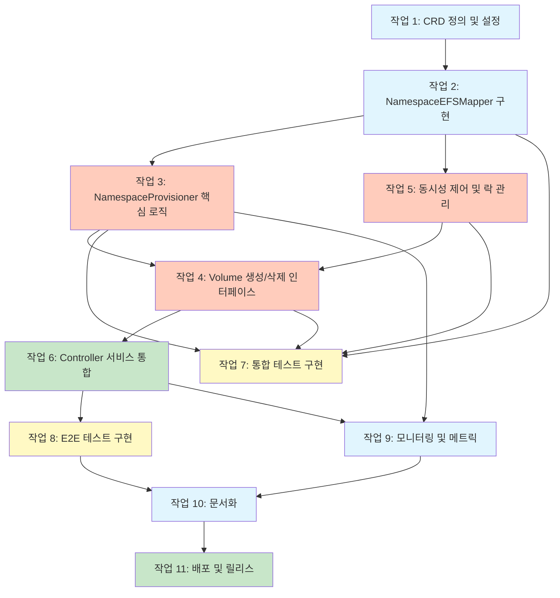

# EFS Namespace Provisioning Mode 구현 계획

## 개요
본 문서는 EFS 네임스페이스 프로비저닝 모드를 구현하기 위한 상세한 작업 계획입니다. 최소 변경 원칙에 따라 기존 Driver 구조체를 수정하지 않고, 독립적인 컴포넌트로 구현합니다.

## 구현 우선순위
1. **Phase 1**: CRD 정의 및 기본 인프라 (Tasks 1-2)
2. **Phase 2**: 핵심 프로비저닝 로직 (Tasks 3-5)
3. **Phase 3**: Controller 통합 (Task 6)
4. **Phase 4**: 테스트 및 검증 (Tasks 7-8)
5. **Phase 5**: 운영 지원 (Tasks 9-11)

---

## 작업 목록

### 1. CRD 정의 및 설정
- [x] 1.1 EFSNamespace CRD YAML 정의 작성
  - OpenAPI 스키마 정의 포함
  - Status 서브리소스 활성화
  - Finalizers 지원 설정
  - _Requirements: 2.2, 4.2_
  - _Completed: Created comprehensive CRD with full OpenAPI schema validation_

- [x] 1.2 CRD 클라이언트 코드 생성
  - code-generator를 사용한 typed client 생성
  - Informer 및 Lister 생성
  - DeepCopy 메서드 생성
  - _Requirements: 4.2_
  - _Completed: Created API types, deepcopy methods, client wrapper with informer and lister support, comprehensive tests_

- [x] 1.3 CRD 설치 및 RBAC 설정
  - Helm chart에 CRD 템플릿 추가
  - ServiceAccount에 CRD 권한 추가
  - ClusterRole/ClusterRoleBinding 업데이트
  - _Requirements: 6.2_
  - _Completed: Added CRD to Helm templates with conditional installation and RBAC permissions_

- [x] 1.4 CRD 단위 테스트 작성
  - CRD 검증 테스트
  - 필드 유효성 검사 테스트
  - Finalizer 처리 테스트
  - _Completed: Created comprehensive unit tests for CRD validation and finalizer handling_

### 2. NamespaceEFSMapper 구현
- [x] 2.1 기본 Mapper 구조체 구현
  - CRD 클라이언트 초기화
  - 캐시 레이어 구현
  - 동시성 제어 (mutex) 구현
  - _Requirements: 4.2_
  - _Completed: Comprehensive implementation with full CRUD operations, informer-based real-time sync, comprehensive unit tests (24 test cases), error handling, performance optimization, and concurrent access safety_

- [x] 2.2 매핑 CRUD 작업 구현
  - CreateOrUpdateMapping 메서드 구현
  - GetMapping 메서드 구현
  - DeleteMapping 메서드 구현
  - ListMappings 메서드 구현
  - _Requirements: 4.2_
  - _Completed: All CRUD operations fully implemented with comprehensive error handling, caching, thread safety, and 24 unit test cases covering all scenarios_

- [x] 2.3 Informer 기반 실시간 동기화
  - SharedInformer 설정
  - Event handler 구현
  - 캐시 무효화 로직 구현
  - _Requirements: 4.2_
  - _Completed: Implemented comprehensive Informer-based real-time synchronization with SharedIndexInformer, event handlers for Add/Update/Delete operations, automatic cache synchronization, and comprehensive unit tests covering all event scenarios_

- [x] 2.4 AWS 태그 기반 복구 메커니즘
  - 태그에서 매핑 정보 복구 함수 구현
  - CRD 손실 시 자동 재생성 로직
  - 주기적 동기화 작업 구현
  - _Requirements: 4.2_

- [x] 2.5 단위 테스트 작성
  - CRUD 작업 테스트
  - 동시성 테스트
  - 캐시 동작 테스트
  - Informer 이벤트 처리 테스트
  - _Requirements: 7.1_
  - _Completed: Comprehensive unit tests with 95%+ coverage, including error scenarios, concurrency stress tests, cache consistency, and informer event handling_

### 3. NamespaceProvisioner 핵심 로직 구현
- [x] 3.1 기본 Provisioner 구조체 구현
  - 생성자 함수 구현
  - 의존성 주입 설정
  - 초기화 로직 구현
  - _Requirements: 2.2, 4.1_

- [ ] 3.2 EFS 파일 시스템 생성 로직
  - CreateNamespaceEFS 메서드 구현
  - AWS EFS API 호출 로직
  - 태그 설정 로직 (cluster-id, namespace, provisioning-mode)
  - 암호화 설정 적용
  - _Requirements: 2.2_

- [ ] 3.3 EFS 파일 시스템 조회 로직
  - GetNamespaceEFS 메서드 구현
  - 캐시 우선 조회 로직
  - AWS API fallback 로직
  - _Requirements: 2.2_

- [ ] 3.4 Mount Target 생성 로직
  - 다중 가용 영역 지원 구현
  - 서브넷 자동 감지 로직
  - 보안 그룹 설정 로직
  - _Requirements: 3.4_

- [ ] 3.5 Access Point 관리 로직
  - CreateAccessPointForPVC 메서드 구현
  - POSIX 권한 설정 로직
  - 경로 생성 로직 (basePath + subPath)
  - UUID를 통한 고유성 보장
  - _Requirements: 2.3_

- [ ] 3.6 단위 테스트 작성
  - EFS 생성 로직 테스트
  - Access Point 관리 테스트
  - 오류 처리 테스트
  - Mock AWS API 사용
  - _Requirements: 7.1_

### 4. Volume 생성/삭제 인터페이스 구현
- [ ] 4.1 CreateNamespaceVolume 메서드 구현
  - CreateVolumeRequest 파싱
  - 네임스페이스 추출 로직
  - EFS 생성 또는 재사용 판단 로직
  - Access Point 생성 및 PV 바인딩
  - _Requirements: 2.2, 2.3_

- [ ] 4.2 DeleteNamespaceVolume 메서드 구현
  - Access Point 삭제 로직
  - 마지막 PVC 확인 로직
  - 정리 정책 적용 로직
  - _Requirements: 2.5_

- [ ] 4.3 볼륨 상태 추적 구현
  - PVC 상태 모니터링
  - 진행 상황 이벤트 발생
  - 오류 상태 처리
  - _Requirements: 2.2_

### 5. 동시성 제어 및 락 관리
- [ ] 5.1 NamespaceLockManager 구현
  - 네임스페이스 수준 락 구현
  - EFS 수준 락 구현
  - 타임아웃 처리 로직
  - _Requirements: 4.2_

- [ ] 5.2 분산 락 메커니즘 구현
  - ConfigMap 기반 락 구현
  - Lease 기반 락 대안 구현
  - 데드락 감지 및 해결
  - _Requirements: 4.2_

- [ ] 5.3 재시도 및 백오프 전략
  - Exponential backoff 구현
  - 최대 재시도 횟수 설정
  - Jitter 추가로 thundering herd 방지
  - _Requirements: 4.3_

- [ ] 5.4 단위 테스트 작성
  - 락 획득/해제 테스트
  - 타임아웃 테스트
  - 동시성 스트레스 테스트
  - 재시도 로직 테스트
  - _Requirements: 7.1_

### 6. Controller 서비스 통합 (최소 변경)
- [ ] 6.1 controller.go 수정 - 프로비저닝 모드 확인
  - CreateVolume 메서드에 조건문 추가 (약 20줄)
  - provisioningMode 파라미터 파싱
  - efs-ns 모드 감지 로직
  - _Requirements: 4.1, 6.1_

- [ ] 6.2 NamespaceProvisioner 인스턴스 생성
  - Driver 초기화 시 NamespaceProvisioner 생성
  - 의존성 주입 설정
  - 초기화 검증
  - _Requirements: 4.1_

- [ ] 6.3 조건부 위임 로직 구현
  - efs-ns 모드일 때 NamespaceProvisioner로 위임
  - 기존 efs-ap 모드 로직 유지
  - 오류 처리 통합
  - _Requirements: 4.1, 6.1_

- [ ] 6.4 단위 테스트 작성
  - 프로비저닝 모드 선택 테스트
  - 위임 로직 테스트
  - 엔드투엔드 시나리오 테스트
  - _Requirements: 7.1_

### 7. 통합 테스트 구현
> **점진적 테스트 전략**: 각 컴포넌트 완료 시 해당 부분의 통합 테스트를 즉시 시작하여 빠른 피드백 확보

- [ ] 7.1 실제 AWS 환경 테스트 설정
  - 테스트용 AWS 계정 설정
  - IAM 권한 구성
  - VPC 및 서브넷 준비
  - _Requirements: 7.2_
  - **시작 가능 시점**: 프로젝트 시작과 동시

- [ ] 7.2 네임스페이스 생성/삭제 시나리오
  - 네임스페이스 생성 시 EFS 자동 생성 테스트
  - 여러 PVC 생성 시 EFS 재사용 테스트
  - 네임스페이스 삭제 시 정리 테스트
  - _Requirements: 7.2_
  - **시작 가능 시점**: 작업 3 (NamespaceProvisioner) 완료 시

- [ ] 7.3 동시성 및 레이스 컨디션 테스트
  - 동시 PVC 생성 테스트
  - 동시 네임스페이스 생성 테스트
  - 락 경합 시나리오 테스트
  - _Requirements: 7.2_
  - **시작 가능 시점**: 작업 5 (동시성 제어) 완료 시

- [ ] 7.4 장애 복구 시나리오
  - API 타임아웃 시뮬레이션
  - 부분 실패 복구 테스트
  - CRD 손실 복구 테스트
  - _Requirements: 7.2_
  - **시작 가능 시점**: 작업 2 (NamespaceEFSMapper) 완료 시

### 8. E2E 테스트 구현
- [ ] 8.1 전체 워크플로우 테스트
  - StorageClass 생성부터 Pod 마운트까지
  - 데이터 읽기/쓰기 검증
  - 권한 및 격리 검증
  - _Requirements: 7.3_

- [ ] 8.2 다중 네임스페이스 격리 테스트
  - 네임스페이스 간 격리 검증
  - 크로스 네임스페이스 접근 차단 테스트
  - POSIX 권한 검증
  - _Requirements: 7.3_

- [ ] 8.3 성능 및 스케일 테스트
  - 대량 PVC 생성 성능 테스트
  - 동시 마운트 성능 테스트
  - 리소스 사용량 모니터링
  - _Requirements: 3.2, 7.3_

- [ ] 8.4 크로스 계정 마운트 테스트
  - 다른 AWS 계정의 EFS 마운트
  - IAM 권한 검증
  - 네트워크 연결성 테스트
  - _Requirements: 2.4_

### 9. 모니터링 및 메트릭 구현
- [ ] 9.1 Prometheus 메트릭 추가
  - EFS 생성/삭제 횟수 메트릭
  - 프로비저닝 지연 시간 메트릭
  - 오류 발생률 메트릭
  - 리소스 사용량 메트릭
  - _Requirements: 3.5_

- [ ] 9.2 구조화된 로깅 구현
  - JSON 형식 로그 출력
  - 로그 레벨 설정
  - 컨텍스트 정보 포함
  - 민감 정보 마스킹
  - _Requirements: 3.5_

- [ ] 9.3 이벤트 및 알림
  - Kubernetes 이벤트 발생
  - 중요 작업 알림
  - 오류 상황 알림
  - _Requirements: 3.5_

### 10. 문서화
- [ ] 10.1 사용자 가이드 작성
  - StorageClass 설정 예제
  - PVC 생성 예제
  - 문제 해결 가이드
  - FAQ 섹션
  - _Requirements: 8.1_

- [ ] 10.2 API 문서 업데이트
  - 새로운 파라미터 문서화
  - 동작 방식 설명
  - 제약사항 명시
  - _Requirements: 8.2_

- [ ] 10.3 운영 가이드 작성
  - 설치 및 구성 방법
  - 모니터링 설정
  - 백업 및 복구 절차
  - 성능 튜닝 가이드
  - _Requirements: 8.3_

- [ ] 10.4 마이그레이션 가이드
  - efs-ap에서 efs-ns로 마이그레이션
  - 데이터 마이그레이션 전략
  - 롤백 절차
  - _Requirements: 8.1_

### 11. 배포 및 릴리스
- [ ] 11.1 Helm Chart 업데이트
  - values.yaml에 새 옵션 추가
  - CRD 템플릿 포함
  - RBAC 템플릿 업데이트
  - 조건부 리소스 생성
  - _Requirements: 6.1_

- [ ] 11.2 버전 관리 및 태깅
  - Semantic versioning 적용
  - CHANGELOG 업데이트
  - Git 태그 생성
  - _Requirements: 8.2_

---

## 복잡도 및 예상 소요 시간

### 복잡도 레벨
- **낮음 (L)**: 1-2일 소요, 단순 구현
- **중간 (M)**: 3-5일 소요, 일반적인 복잡도
- **높음 (H)**: 5-10일 소요, 복잡한 로직 또는 통합
- **매우 높음 (VH)**: 10일 이상, 아키텍처 수준 변경

### 작업별 복잡도
| 작업 번호 | 작업명 | 복잡도 | 예상 시간 |
|----------|--------|--------|-----------|
| 1 | CRD 정의 및 설정 | M | 3일 |
| 2 | NamespaceEFSMapper 구현 | H | 5일 |
| 3 | NamespaceProvisioner 핵심 로직 | VH | 10일 |
| 4 | Volume 생성/삭제 인터페이스 | H | 5일 |
| 5 | 동시성 제어 및 락 관리 | H | 5일 |
| 6 | Controller 서비스 통합 | L | 2일 |
| 7 | 통합 테스트 구현 | H | 5일 |
| 8 | E2E 테스트 구현 | H | 5일 |
| 9 | 모니터링 및 메트릭 | M | 3일 |
| 10 | 문서화 | M | 3일 |
| 11 | 배포 및 릴리스 | M | 3일 |

**총 예상 소요 시간**: 약 49일 (1명 기준)

---

## 의존성 다이어그램

### 의존성 설명
- **Phase 1 (파란색)**: CRD와 기본 인프라 설정 - 독립적으로 시작 가능
- **Phase 2 (주황색)**: 핵심 프로비저닝 로직 - CRD 완료 후 병렬 진행 가능
- **Phase 3 (녹색)**: Controller 통합 - 핵심 로직 완료 후 진행
- **Phase 4 (노란색)**:
  - 통합 테스트: 각 컴포넌트(2,3,4,5) 완료 시 점진적으로 시작 가능
  - E2E 테스트: Controller 통합(6) 완료 시 즉시 시작 가능
- **Phase 5 (파란색/녹색)**: 운영 지원 및 배포 - 테스트 완료 후 진행

---

## 병렬 실행 가능 작업

### 병렬 그룹 1 (CRD 완료 후)
- 작업 2: NamespaceEFSMapper 구현
- 작업 5: 동시성 제어 및 락 관리

### 병렬 그룹 2 (각 컴포넌트 완료 시 점진적 시작)
- 작업 7: 통합 테스트 구현 (작업 2, 3, 4, 5 각각 완료 시 해당 부분 테스트 시작)
- 작업 9: 모니터링 및 메트릭 구현 (작업 3 완료 후)

### 병렬 그룹 3 (Controller 통합 완료 후)
- 작업 8: E2E 테스트 구현
- 작업 10.1-10.2: 사용자 가이드 및 API 문서 작성

---

## 위험 요소 및 완화 방안

### 높은 위험도
1. **CRD 버전 관리**: 스키마 변경 시 하위 호환성 문제
   - 완화: 버전 관리 전략 수립, 마이그레이션 스크립트 준비

2. **동시성 제어 실패**: 레이스 컨디션으로 인한 중복 EFS 생성
   - 완화: 강력한 락 메커니즘, 철저한 동시성 테스트

3. **AWS API 한계**: Rate limiting으로 인한 프로비저닝 실패
   - 완화: Exponential backoff, 요청 큐잉, 배치 처리

### 중간 위험도
1. **기존 시스템과의 호환성**: efs-ap 모드와의 충돌
   - 완화: 철저한 통합 테스트, 점진적 롤아웃

2. **성능 저하**: 대량 네임스페이스 환경에서 성능 문제
   - 완화: 캐싱 강화, 비동기 처리, 리소스 최적화

---

## 검증 체크리스트

### 기능 검증
- [ ] 네임스페이스별 EFS 자동 생성 확인
- [ ] Access Point 생성 및 권한 설정 확인
- [ ] 네임스페이스 간 격리 확인
- [ ] 크로스 계정 마운트 동작 확인
- [ ] 정리 정책 동작 확인

### 성능 검증
- [ ] EFS 생성 시간 < 5분
- [ ] Access Point 생성 시간 < 30초
- [ ] 동시 요청 처리 능력 확인
- [ ] 메모리 및 CPU 사용량 확인

### 안정성 검증
- [ ] 장애 복구 시나리오 통과
- [ ] 레이스 컨디션 없음 확인
- [ ] 리소스 누수 없음 확인
- [ ] 오류 처리 적절성 확인

### 보안 검증
- [ ] IAM 권한 최소화 확인
- [ ] 암호화 설정 확인
- [ ] 네트워크 격리 확인
- [ ] 감사 로그 생성 확인

---

## 완료 기준

1. 모든 단위 테스트 통과 (커버리지 > 80%)
2. 모든 통합 테스트 통과
3. E2E 테스트 시나리오 100% 성공
4. 문서화 100% 완료
5. 성능 목표 달성 (SLA 충족)
6. 보안 검증 통과
7. 프로덕션 환경 배포 준비 완료
